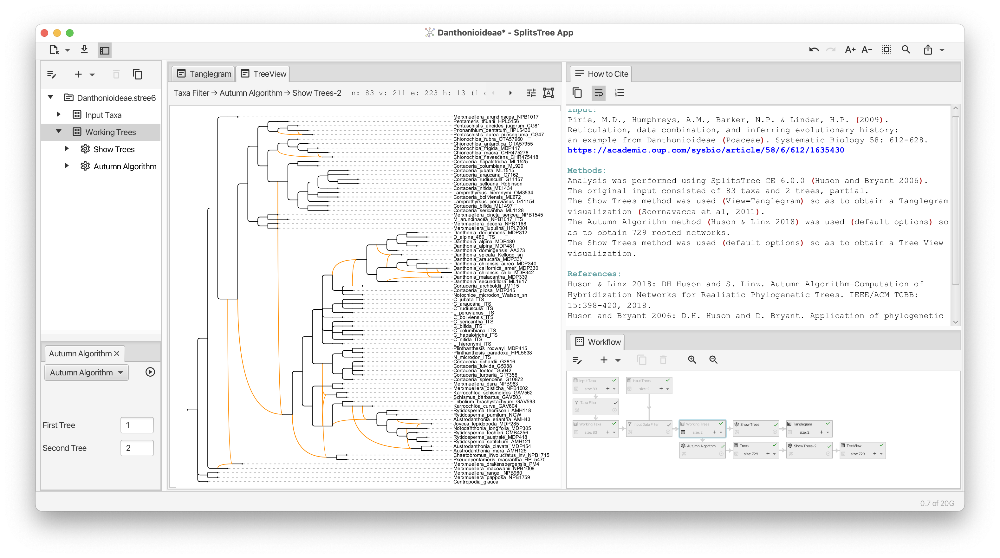

#  SplitsTree App

Download latest executables: https://software-ab.cs.uni-tuebingen.de/download/splitstree6/welcome.html (alternative download [here](https://unitc-my.sharepoint.com/:f:/g/personal/iijhu01_cloud_uni-tuebingen_de/ErFbVRLEdw5ElYuu0ldpbskBM9XmXOHdeFadVTlssq1Bzg?e=KDefhC)).

The new SplitsTree App is designed as an open source project that provides a wide range of algorithms and processes for computing and working with both unrooted and rooted phylogenetic trees and networks. Much work has been invested in accommodating much larger datasets (more taxa, longer sequences, more trees, improved algorithms) than its predecessor programs, SplitsTree4 and Dendroscope3, and its user interface is based on the JavaFX library, giving it a modern look and feel.

One main aim of this program is to make it easy to compute both trees and networks, hopefully encouraging researchers to use phylogenetic networks when appropriate. A second aim is to bring together the calculation of both unrooted and rooted trees and networks into one program. Moreover, the program explicitly supports the import and export of data in many different formats, making it easy to use the program in collaboration with other programs.

## User manual

The user manual for this software is available as a [PDF](./SplitsTree_App_Manual.pdf) and also an online [page](./user_manual.pdf).

## Explicit representations of workflows

A key novel feature of the SplitsTree App is that all data, algorithms and parameters are explicitly modeled as a "workflow", that is, a graph that represents the provenance of a result. While a casual user will interact with the program via menu items and other controls, an advanced user can directly edit and interact with the workflow so as to setup an analysis that goes beyond the basic analyses offered by the program. Another novel feature of the program is that the workflow is analyzed so as to produce a textual representation of the analysis, together with all relevant citations, thus providing the framework for a "methods section" of a corresponding paper.

Any workflow can be saved to a file and then applied to other datasets either using SplitsTree App or using an accompanying command-line workflow runner program.

## History
Our previous program,  SplitsTree4, was designed for computing phylogenetic trees and networks from distances or aligned sequences. It was written in the early 2000's by Daniel Huson and Dave Bryant and described in [(Huson and Bryant, 2006)](https://academic.oup.com/mbe/article/23/2/254/1118872). While the program is still widely used and cited, it was designed for small datasets and the user interface, implemented using the Java Swing library, now feels minimalistic and dated. Moreover, SplitsTree4 was not designed as an open source program.
(SplitsTree5 was our first attempt to rewrite SplitsTree4, however, some unfortunate early design decisions lead to code that was difficult to extend and so we have abandoned the development of Splitstree5. We consider it an evolutionary dead end).

While SplitsTree4 was designed for unrooted phylogenetic trees and networks, another previous program Dendroscope3 [(Huson and Scornavacca, 2012)](https://academic.oup.com/sysbio/article/61/6/1061/1666897) was designed for working with rooted trees and networks. This program, too, was designed for much smaller datasets than people work with today.

## How to cite

A manuscript describing the new SplitsTree app will be submitted soon, together with a comphrensive user manual.

For now, please cite: 
Daniel H. Huson and David Bryant, Application of Phylogenetic Networks in Evolutionary Studies, Molecular Biology and Evolution, 23(2):254-267 (2006) [https://doi.org/10.1093/molbev/msj030](https://doi.org/10.1093/molbev/msj030).

