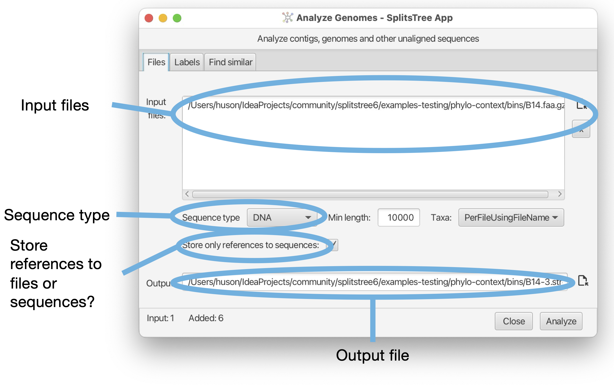
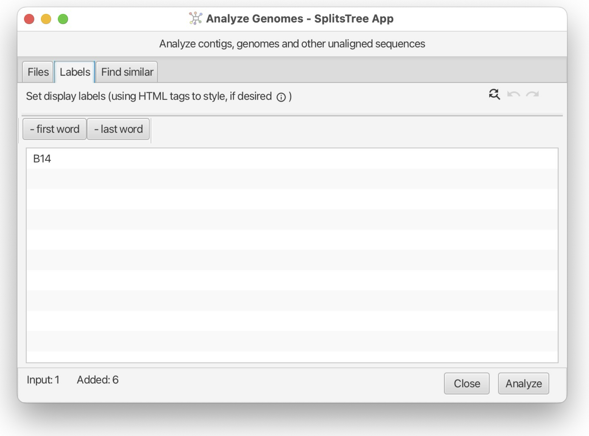
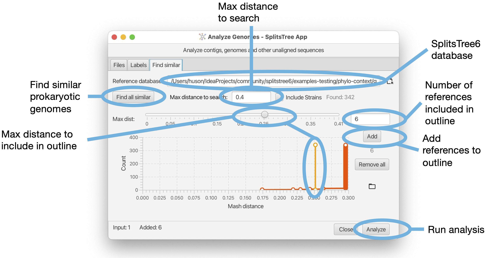

# SplitsTree App User Manual

## Daniel H. Huson and David Bryant

SplitsTree App (version 6.3.12, built 24 Apr 2024)
## Introduction

The SplitsTree App is new software for exploring and analyzing
phylogenetic data, with an emphasis on phylogenetic networks. Offering a
comprehensive set of features, the software provides over 100 algorithms
for computing distances, phylogenetic trees, split networks, haplotype
networks, rooted phylogenetic networks, tanglegrams, consensus trees and
consensus networks.

This new software is designed to accommodate the increasing scale and
intricacy of modern data sets. It extends, integrates and supersedes our
earlier applications SplitsTree4 [@HusonBryant2006] for unrooted
phylogenetic trees and networks, Dendroscope3 [@HusonScornavacca2012]
for rooted trees and networks, and PopArt [@LeighBryant2015] for
haplotype analysis.


# Using SplitsTree

In this chapter we give an overview of how the interface of the
SplitsTree app is organised. Later we provide more details on the actual
methods and procedures.

## Getting started

To get started using this program, download the latest installer from
<https://software-ab.cs.uni-tuebingen.de/download/splitstree6> for
Linux, MacOS X or Windows, and install the program on your computer.
Versions for iOS and Android are being tested.

Launch the program by double-clicking the program icon or launch it from
the command line (Linux).

Use the `File->Open...` menu item to open a file containing data in one
of the supported formats .

If the data you provide is set of characters (or multiple sequence
alignment), then by default, the SplitsTree app will compute P-distances
and then will run Neighbor Net to obtain a split network . If you
provide a distance matrix, then this will also result in a split network
being displayed. If you supply trees, then the first tree will be
displayed .

Here is a toy example of characters data. You can copy this text from
the manual and then paste it onto the import data button to obtain the
network show in the figure (.

    6 64
    Taxon1 TAAGTAGATCGGAGTTTTTACTCGTGTGATTTTGGGTATTTTTTATTTAGATTATGAAATTATA
    Taxon2 CTTAATATATAATGATATTACTTAAACATTATTAAATGATACACTAACTATAATTATTGAACAT
    Taxon3 AAAATTATATAATATAACATTATATTCATTACCACAAGATTATATTATAAAATATATTGTACAC
    Taxon4 TTCAATATATAATGAAACTTTATAAATAACTTTAGAAATCTTATAAAAAAATATCGACGAACAA
    Taxon5 TAAGTAGATCTGAGTTTTTACTCGTGTGATTTTGGGTATTTTTTATTTAGATTATGAAATTATA
    Taxon6 TAAATTGGATAATATTTTATTATGTGTTACTACAGAAATCATTAATTATATAAACGATATACAA


## Layout of the main window

In the SplitsTree app, you can open one or more documents and each one
has its own main window. Different analyses of the same data in the same
document are shown in different tabs in that window . Tabs can be laid
out side-by-side.

![The main window. (a) Text and graphic output are presented in the main
tabs on the right-hand side of the window. (b) There is a side-bar on
the left hand side that shows (c) the workflow at the top and (d) tabs
for setting algorithm parameters at the bottom. At the top left (e)
there are some document-specific tool-bar items whereas the items at the
top right (f) apply to the current main tab. While all program features
can be directly accessed from the main window, the menu bar (g) provides
alternative access to many of the features.
](figs/window.png)

Each document opened in SplitsTree has its own main window. The main
window has the following parts:

- A menu bar providing menu items to access features of the program.
  Note that all features or the program can also be accessed from
  within the main window as well (figure part g).

- A toolbar containing both document- and tab-specific items (figure
  parts e,f).

- A main tab pane that contains all the text and data tabs (figure
  part a).

- A sidebar providing access to the workflow (figure parts b,c).

- An algorithms tab pane (inside the sidebar) for parameterizing and
  running algorithms (figure parts b,d).

## Main toolbar items

There are three *document-specific toolbar items* on the left side of
the main toolbar and several *tab-specific toolbar items* ones on the
right .


Document specific toolbar items:

- The *files menu button* - provides a menu that contains file-related
  items from the main files menu and a list of recently opened
  documents.

- The *import data button* - use this open any string or file from the
  system clipboard, or via drag-and-drop, into a new SplitsTree
  document.

- The *sidebar toggle button* - use this to show or hide the sidebar.

Tab specific tool bar items (that apply only to the currently selected
main tab):

- An *undo button* and *redo button*.

- An *increase font size button* and *increase font size button*.

- A *selection button* to select all or none.

- A *find button* that you press to open the find dialog, press again
  to open the replace dialog (if available) and once again to close
  the dialog.

- An *export button* that gives access to items for copying, exporting
  or printing the data or image associated with the current tab. An
  additional item is provided for showing or hiding the *QR code*
  associated with a given tree or network.

## The main tabs

The main window uses a tabbed pane to present all text and
visualizations . Here is an overview of the supported tabs:

- Alignment tab - provides a visualization of the input multiple
  sequence alignment.

- Tree-View tab - shows a phylogenetic tree or rooted network.

- Tree-Pages tab - shows pages of phylogenetic trees or rooted
  networks.

- Tanglegram tab - shows a tanglegram of trees or rooted networks
  [@Scornavaccaetal2011].

- Densi-Tree tab - shows a densi-tree visualization of a profile of
  trees [@Bouckaert2010].

- Split-Network tab - show a split network [@DressHuson2004] or
  phylogenetic outline [@Bagcietal2021].

- Network tab - shows a network such as a haplotype network
  [@Bandeltetal1999].

- World map tab - shows a map of the world and displays traits data
  that have associated and latitude and longitude coordinates.

- Workflow tab - provides access to the workflow graph.

- How to cite tab - provides a description of the data and algorithms
  used, and provides the necessary citations.

- Input editor tab - provides an interactive editor for entering and
  parsing input data.

- Report tabs - these are used to present the results of analyses such
  as phylogenetic diversity.

- Text tabs - any of the data blocks can be displayed in such a text
  tab, they provide several different formats.

## Alignment tab

The *Alignment tab* provides a visualization of the input characters or
multiple sequence alignment .


The alignment tab has a drop-down menu button at the left that contains
items for selecting sites. There is a button for selecting a color
scheme. There is a button for toggling between a close-up view and a
total view of the alignment, and buttons for zooming in and out both
vertically and horizontally.

## Tree-View tab

The *Tree-View tab* shows a phylogenetic tree or a rooted network .


The tree view tab has a toolbar and side panel that are hidden by
default, but can be opened using two toggle buttons at the top right of
the tab.

The toolbar provides items for selecting how to draw the tree (or rooted
network), the choices are between rectangular, circular and radial
cladogram or phylogram. There is a button that toggles the scale bar and
addition information (such as name of the tree, if any, and number of
nodes, edges and leaves). In addition, there are buttons for rotating,
flipping and zooming.

The side panel (on the right) contains items for styling the taxon
labels and for adding marks to the taxa. These are colored shapes that
appear next to the taxon label. There are items for displaying taxon
traits, if present. Moreover, there are items for setting the line width
of edges and to choose whether to label edges by associated weights or
confidence values.

## Tree-Pages tab

The *Tree-Pages tab* shows pages of phylogenetic trees .


The tree-pages tab has a toolbar and side panel that are hidden by
default, but can be opened using two toggle buttons at the top right of
the tab.

The toolbar provides items for selecting how to draw the tree (or rooted
network), the choices are between rectangular, circular and radial
cladogram or phylogram. There is a button that toggles addition
information (such as name of the tree, if any, and number of nodes,
edges and leaves). In addition, there are buttons for rotating, flipping
and zooming. At the right side of the tool bar, there is a text input
field for setting the dimensions of a page in the format *rows x cols*.

The side panel contains items for styling the taxon labels and for
adding marks to the taxa.

At the bottom of the tree-pages tab there is a row of buttons that can
be used to navigate through the pages.

## Tanglegram tab

The *Tanglegram tab* shows a tanglegram of trees or rooted networks
[@Scornavaccaetal2011] .


The tanglegram tab has a toolbar and side panel that are hidden by
default, but can be opened using two toggle buttons at the top right of
the tab.

The toolbar provides items to determine the first and second trees (from
the same file) and for selecting how to draw either tree (or rooted
network), the choices are between rectangular phylogram, rectangular
cladogram and triangular cladogram (trees only). There is a button that
toggles addition information (such as name of the tree, if any, and
number of nodes, edges and leaves). In addition, there are buttons for
rotating, flipping and zooming.

The side panel contains items for styling the taxon labels and for
adding marks to the taxa.

## DensiTree tab

The *Densi-Tree tab* shows a densi-tree visualization of a Bayesian
profile of trees [@Bouckaert2010] .


The densi-tree tab has a toolbar and side panel that are hidden by
default, but can be opened using two toggle buttons at the top right of
the tab.

The toolbar provides items for determining how to draw the trees,
choices are between rectangular, triangular, rounded and radial
phylogram. (The rounded phylograms are time-consuming to draw and can
cause problems.) In addition, there are buttons for rotating, flipping
and zooming.

The side panel contains items for styling the taxon labels and for
adding marks to the taxa. The line width can be set here. In addition,
two colors can be set. The first is used for edges that in the tree
profile that are compatible with the displayed greedy consensus tree
(default color is black), and the second is used for incompatible edges
(default color is red).

## Split-Network tab

The *Split-Network tab* shows a split network [@DressHuson2004] or
phylogenetic outline [@Bagcietal2021] .


The split-network tab has a toolbar and side panel that are hidden by
default, but can be opened using two toggle buttons at the top right of
the tab.

The toolbar provides a choice box to determine how to draw the splits.
The choices are as a split network, to-scale or as a topology (with all
edges of uniform length), or as a phylogenetic outline, again, either
to-scale or as a topology (with all edges of uniform length). There is a
second choice box to determine whether the network is to be drawn
unrooted or rooted, using either *mid-point rooting* or *outgroup
rooting*. The latter requires that some taxa have been selected; these
are treated as the outgroup.

In addition, there are buttons for rotating, flipping and zooming. The
rotate buttons act differently depending on whether edges in the network
are selected or not. If no edges or nodes are selected, then the entire
network is rotated. If one or more edges are selected then only the
edges (corresponding to one or more splits) are rotated.

The side panel contains items for styling the taxon labels and for
adding marks to the taxa. The line width can be set here. In addition,
the line width and color can be set. The color of the inner area of an
outline can be set. You can request to have the splits labeled by their
weight, their confidence values (if available) or their internal split
ids.

## Network tab

The *Network tab* shows a network . The network tab has a toolbar and
side panel that are hidden by default, but can be opened using two
toggle buttons at the top right of the tab.


The toolbar provides a choice box to determine how to draw the network.
In addition, there are buttons for rotating, flipping and zooming.

The side panel contains items for styling the taxon labels and for
adding marks to the taxa. The line width can be set here. In addition,
there are items to determine which traits are to be shown in pie charats
and whether to a legend. Also, there is a menu button for determining
how to represent character-state changes along an edge. The choices are
has hatches (short marks), labels, compact labels and counts.

## World map tab

The *World Map tab* shows a map of the world and places any traits data
that comes with latitude and longitude assignments on the map . The
world tab has a toolbar and side panel, the latter is hidden by default,
but can be opened using the toggle button at the top right of the tab.

This tab appears when the input data contains a traits block that has
latitude and longitude specifications .


There is a `Show` menu button to determine whether country names,
continent names and/or oceans should appear as labels. There is a button
to determine whether to show two copies of the map side-by-side for
Pacific-centric data. There is a button to zoom to the shown haplotype
data.

## Workflow graph tab

The *workflow tab* provides access to the *workflow graph* .


The workflow tab has a toolbar that contains a number of items, whose
purpose and enabled state depends on which nodes in the workflow graph
are currently selected.

The first toolbar item will open the corresponding algorithm, text
display or view tab, depending on whether the selected node is an
algorithm node, data node or view node. Double-clicking on a node has
the same effect.

When a data node is selected, then the second toolbar item can be used
to attach an additional algorithm to the data node.

When an algorithm node is selected, then the next two items can be used
either to duplicate the analysis, or to delete it, respectively. Each
algorithm node also carries a similar menu button.

There are two items for zooming in and out.

## How to cite tab

The *How to cite tab* provides a description of the data and algorithms
used, and provides the necessary citations .


The toolbar of the input tab contains a button to copy the complete or
selected content of the tab. There are buttons to turn line-wrapping and
lines numbers on and off.

If the input is a Nexus or SplitsTree file that contains a comment at
the beginning of the file describing the source of the data, then this
will be reported at the top of the text area. This is followed by a
description of the methods used. Finally, all suggested references are
listed.

## Input editor tab

The *Input editor tab* provides an interactive editor for entering and
parsing input data .


The toolbar of the input tab contains a button to copy the complete or
selected content of the tab. There buttons to turn line-wrapping and
lines numbers on and off.

The program will try to guess to which input format the entered text
adheres to and will indicate the name of the format in the toolbar. When
a valid format has been detected, then the run button will be enabled.
Pressing the run button will parse the data and launch an analysis of
the entered data.

The input editor can be opened from the File menu and is automatically
open when the user imports a text or file into the program that is not
in one of the recognized input formats.

## Report tabs

*Report tabs* are used to present the results of analyses such as
Tajima' D, phylogenetic diversity or Shapely values as a text .


The toolbar of the report tab contains a button to copy the complete or
selected content of the tab. There are buttons to turn line-wrapping and
lines numbers on and off.

## Text tabs

*Text tabs* are used to show the content of data blocks, in a choice of
several different formats .


The toolbar of any text tab contains a button to copy the complete or
selected content of the tab. There are buttons to turn line-wrapping and
lines numbers on and off. There is a format pane that can be used to
select the desired display format and to specify any options associated
with the format.

Such a text tab can be opened by selecting a data node item in the side
bar and then pressing the show/edit button at the top of the side bar,
or by double-clicking on the item.

## The side bar

The sidebar (figure part b) contains a representation of the workflow as
a tree at the top, and the algorithms tab pane at the bottom (figure
parts c,d).

The *workflow tree view* contains a representation of all input data,
computed data and algorithms used in the computation. There are three
types of nodes:

- *data nodes* that represent data blocks and result blocks,

- *algorithm nodes* that represent algorithms, and

- *view nodes* that represent visualizations.

Double-clicking on a data node will open a text tab displaying the
corresponding data, or analysis result, if the data block is a report.
Double-clicking on an algorithm node will open the corresponding
algorithm tab.

An algorithm tab has a run button (at the right) to execute the
algorithm and may contain some optional input items (below) to set
parameters of the algorithm.

## The draft genome dialog

The SplitsTree App supports the calculation of the *phylogenetic
context* of a draft prokaryotic genome [@Bagcietal2021]. One or more
files (FastA format) each containing one or more sequences representing
draft genomes (or metagenomic assembly bins) can be imported into the
program and then compared against a set of GTDB reference genomes
[@Parksetal2018] using mash distances [@Ondovetal2016] and then
represented as a phylogenetic outline.

The dialog is opened using the `File->Analyze Draft Genomes...` menu
item and is setup using three tabs, as shown in the Figure.

<figure>
<div class="tabular">
<p><span>cc</span> &amp; <br />
<span></span><br />
</p>
</div>
<figcaption> The first tab is used to specify the input files, the type
of input (DNA or protein sequences) and whether to use files or FastA
records as input genomes. Also, specify the output file (and whether to
store input sequences as sequences or as references to files). The
second tab is used to edit the labels of genomes. The third tab is used
to specify the database to compare against (downloaded from the
SplitsTree page), the distance to search in, and distance within which
to include references. </figcaption>
</figure>

# Building trees and networks

## Using the workflow

In SplitsTree4, data analysis was based on a simple linear sequence. To
construct a Neighbor Net, for example, one might input character data,
apply a transform to infer a distance matrix, apply another transform to
produce the set of splits in the Neighbor Net and another transform for
convert those splits into a network on the screen.

That simplicity came with limitations. For example, to compare the
result of analyses using different parameters or distance methods it was
necessary to duplicate the whole file and start again.

The SplitsTree App implements a far more sophisticated system for
workflows. It is still straightforward to run a simple linear workflow
as in SplitsTree4, but it is now possible to branch that workflow at any
point, exploring alternative parameters or methods. The use of frames
make it easy to view the results of different analyses side-by-side.

The branching structure of a document's workflow can be viewed in the
side panel (as a hierarchy) or in the workflow panel (as a graph). To
illustrate, open the example file `ungulates.nex` which can be found in
the directory `publications/WelkerEtal2015` in the Examples directory.
By default, the SplitsTree App creates a network by running Neighbor Net
and using the $p$-distance. Switching to the workflow panel displays the
(linear) workflow for this initial analysis .


In this graph, nodes correspond to algorithms (indicated by a
 icon) or data (indicated
by a  icon). From the
algorithm nodes you can edit the parameters of the method. Selecting an
algorithm node and clicking the delete icon (top of pane) removes that
node and any descendants of that node.


Suppose we want to compare a network computed by the Neighbor Net
algorithm with a tree obtained using BioNJ. Assuming both are to be
computed from the same distance matrix, we can select the corresponding
node and choose BioNJ from the popup menu marked with a plus (either on
the node or in the toolbar) . SplitsTree then constructs and displays
the BioNJ tree. Switching back to the workflow panel we see that a new
sequence of nodes has branched off the distances node, indicating the
revised analysis.


This analysis also creates a new window tab. Right-click on a tab to get
a context menu that allows you to split the main tab pane into two
parts, then drag the tabs to the left or right panes to view both the
Neighbor Net network and the BioNJ tree side-by-side.

## Building trees

SplitsTree implements four standard tree construction methods:

- NJ (Neighbor-Joining), the original method of Saitou and Nei
  [@SaitouNei1987].

- BioNJ, the modification of NJ introduced by Gascuel to reduce
  variance of the node-to-node estimates [@Gascuel1997].

- UPGMA, the agglomerative method for constructing ultrametric
  (molecular clock) trees, introduced by Sokal and Sneath
  [@SokalMichener1958].

- Buneman, a method for inferring compatible splits (and therefore
  trees) from distances which tends to produce trees with large
  multifurcations [@BandeltDress1992].

Each of these can be called from the `Trees` menu, or added as an
algorithm in the workflow. There are several options for displaying
trees, available by clicking on one of the two icons on the
right-hand-side of the tree window:


. .

## Neighbor Net and other split network methods

### Neighbor Net

Given a distance matrix as input, the *Neighbor Net* algorithm operates
in three stages. First, an agglomerative method is used to identify a
circular ordering of the taxa. The splits computed by the algorithm are
a subset of the set of all splits that can be formed from consecutive
sets of taxa in that ordering. Second, a heavily customized algorithm is
used to efficiently compute split weights. Those with zero weight are
removed (use a split filter to remove splits with larger weight).
Finally, a planar split network algorithm takes the weighted splits and
produces the split network representation. A complete description of the
entire process is available in [@BryantHuson2023].

There is a single option available in Neighbor Net, the method used to
infer split weights. We found that the Active Set method performed
better than the other methods, and this is the default and recommended
option. We have left the other algorithms as options in order to enable
a repeat of the analysis in [@BryantHuson2023].

When Neighbor Net is called, SplitsTree produces a split block and a
split network block in the workflow. As we stress in [@HusonBryant2006],
the main information in the network is the set of weighted splits. Think
of the network as a means of visualising the splits, in the sense that
the same set of splits can be represented in several different ways.

### Manipulating split networks

To rotate or flip the entire network, use the toolbar revealed by
pressing the preferences icon in the top right of the split network
panel, making sure that none of the nodes or edges in the network are
selected .

Click on an edge in the split network to select that split. The edges
associated to that split can be rotated using the rotate buttons in the
toolbar or the arrows in the side panel which appears when you click the
icon on the right .


The traditional approach to displaying split networks marks out the
splits with a mesh of quadrilaterals and polygons. The outline
representation [@Bagcietal2021] constructs just the outer perimeter of
the network. This is sufficient to represent all of the split weights,
and is generally much faster to compute and draw. To switch back and
forward between the graph mode and the outline mode use the pop-up menu
at the left of the toolbar .

### Split Decomposition

Given a distance matrix, the *Split Decomposition* method
[@BandeltDress1992] can selected in the Network menu, or on a distances
node in the workflow. *Split Decomposition* is a predecessor of Neighbor
Net, though the structures of the two methods are quite different. Split
Decomposition works by inferring a set of splits satisfying a quartet
condition in the distance matrix. Split Decomposition produces a set of
weakly compatible splits and, as such, can produce more complex split
networks than those produced by Neighbor Net. The resulting split
network will not necessarily be planar. In practice, the conservative
nature of the selection criteria means that Split Decomposition produces
far fewer splits than Neighbor Net.

### Splits in characters

SplitsTree includes several methods for extracting splits directly from
character data. These methods do not assume any explicit model for
sequence evolution. As such they do not correct for hidden mutations.
However they can reveal important structure within sequences from
closely related organisms, as well as artefacts resulting from data
handling problems.

The simplest is `BinaryToSplits` , which applies to binary data only.
Each binary character determines a split separating those with
allele/state 0 and those with allele/state 1. The weight assigned to a
split equals the summed weight for all characters inducing that split,
defaulting to a count of those characters if weights are not specified.
The `BinaryToSplits` algorithm is available via the workflow graph or
workflow hierarchy. The user can specify a weight/count threshold on the
splits, a cap on the maximum dimension of the split network and the
option to include all 'trivial' splits separating one taxa from the
remainder automatically.

The `DNAtoSplits` method carries out a similar analysis but on
nucleotide data. Splits are either determined via an RY coding (AG vs
CT) or by splitting the most frequent state (assumed ancestral) from the
other states (assumed derived) at each site.

The *Parsimony Splits* method , introduced by [@BandeltDress1992],
produces a set of weakly compatible splits directly from character taxa.
The method is quartet based, like Split Decomposition, but for each four
taxa, it determines the two most frequent pairings of two taxa versus
the other two taxa.

## Haplotype networks

A haplotype network is an elegant and efficient way to represent
character or sequence data. Each node corresponds to a particular
sequence with the size of the node proportional to the number of copies
of that sequence in the data. Sequences which differ in one position are
connected by an edge which is (optionally) labelled by the exact
difference. Different methods for constructing haplotype networks
generate different graphs for connecting sequences at larger distances.
For them all, a key property is that given one sequence, the network,
and the mutations along each edge, the entire alignment can be
reconstructed.

SplitsTree provides implementations of two widely-used haplotype network
methods, MinSpanningNetwork [@ExcoffierSmouse1994] and MedianJoining
[@Bandeltetal1999]. Haplotype networks are drawn as graphs with each
edge labelled by marks indicating the number of mutations/differences
along that edge. This can be modified using the side panel which appears
when clicking the preferences icon in the top right of the network
panel.

### Minimum spanning network

A minimum spanning tree for a graph is a connected subgraph of minimum
weight. Sometimes there is a unique minimum spanning tree; other times
there are multiple.

In this context, the graph contains a node for each input sequence and
and edge between every pair of nodes. The length of each edge is the
Hamming distance between the corresponding sequences. Other distance
measures can be used, but the Hamming distance is appropriate for
Haplotype Network construction.

The minimum spanning network is formed from all those edges in the graph
which appear in every minimum spanning tree .

A minimum spanning network is constructed from a characters block by
first determining Hamming distances (right click on the characters block
and select `Add Algorithm -> Hamming distance`). Then right click on the
distance block produced and add the `Min Spanning Network` algorithm.

### Median Joining network

Median Joining is probably the most highly-cited method for constructing
phylogenetic networks. The implementation in SplitsTree is based on the
method described in [@Bandeltetal1999]. The Median-Joining network
method makes repeated use of minimum spanning networks, each time
augmenting the set of observed sequences with putative ancestral
sequences.

A Median-Joining network is constructed from a characters block via the
Network menu, or by adding an algorithm to the workflow. The method
comes with a single option $\epsilon$ that is an integer controlling a
threshold determining when two sequences are considered adjacent. In
[@Bandeltetal1999], $\epsilon$ varies between $0$, $1$ and $2$.

## Rooted phylogenetic networks

### Implicit vs explicit trees and networks

A haplotype network is a direct representation of the input data and a
split network represents groupings or splits between taxa. Both are
examples of so-called *implicit* or *data-display* networks that aim at
visualizing evolutionary data. In contrast, an *explicit network* is a
representation of the putative evolutionary history, including
reticulate events such as speciation-by-hybridization or horizontal gene
transfer.

Strictly speaking, unrooted phylogenetic trees, too, are implicit
representations of evolutionary data, whereas rooted phylogenetic trees
have a direction (away from the root) and this allows branching nodes to
be explicitly interpreted as representing speciation events.

Explicit phylogenetic networks are necessarily rooted. The Autumn
algorithm [@HusonLinz2018] produces an explicit rooted phylogenetic
network in which reticulations may be interpreted as putative
hybridization or HGT events. However, just because a phylogenetic tree
has a root does not mean that it is explicit. For example, the Cluster
Network algorithm takes as input a set of rooted trees and aims at
displaying all their clusters as a rooted network (in the hardwired
sense [@Husonetal2012]). Here, the reticulate nodes do not have a direct
biological interpretation.

### Hybrization networks

![On the left we see two different gene trees on waterlilies
[@Gruenstaeudl2019] and on the right we see one of three different
hybridization networks with hybridization number $h=4$, computed using
the Autumn algorithm.](figs/autumn-example.png)

In mathematical phylogenetics, a *hybrization network* is a rooted
phylogenetic network that contains or displays an input set of rooted
phylogenetic trees. Usually, the requirement is that such a network
minimizes the "hybridization number".

SplitsTree currently offers two algorithms for computing such networks.
The Autumn algorithm [@HusonLinz2018] ) takes as input two rooted
phylogenetic trees and computes, as output the list of all different
hybridization networks that contain the two trees. This algorithm is
designed for real-world applications and so input trees may have
multifurcations and unequal taxon sets. This algorithm aims at providing
an exact solution (networks that minimize the hybridization) of a
computational hard problem, so it might not terminate if the input trees
have too many conflicts.

The PhyloFusion algorithm [@Zhangetal2023; @Zhangetal2024] takes as input
multiple rooted trees and computes one or more rooted phylogenetic
networks that display all the input trees. This heuristic aims at
minimizing the hybridization number. With this, we provide a versatile
method for exploring the practical use of rooted networks in
phylogenetics.

### Cluster networks

The Cluster Network algorithm extracts all clusters from an input set of
rooted phylogenetic trees and computes a network using the
cluster-popping algorithm [@Husonetal2012]. This is a fast algorithm
that provides a network that contains all input trees. However, it does
not aim at minimizing the hybridization number.

# Consensus trees and networks

The methods in this chapter all attempt to summarise information
contained in a set of trees. (Most also work if the input contains
rooted phylogenetic networks, in which case the calculations are based
on "hardwired clusters" contained in the networks.) There are several
possible sources:

1. Trees returned from different genes or loci.

2. Trees produced from different methods.

3. Trees produced from different bootstrap replicates.

4. Trees sampled from the posterior distribution in a Bayesian
   analysis.

One of the big improvements with the most recent version of SplitsTree
is that the routines for reading in files of trees can now cope with
large tree files or large trees.

## Consensus trees

A consensus method summarises a set of trees (on the same set of taxa)
with a single tree. It can be thought of as analogous to an average tree
or median tree.

### Average consensus method

The average consensus method implements an idea of
[@LapointeCucumel1997]. Additive (leaf to leaf) distance matrices are
constructed for each tree. This can take some time on larger files. The
average of these matrices are then used to construct either a
Neighbor-Joining tree or a NeighborNet.

The method can be called from the workflow by selecting a trees block
and adding the algorithm 'Average Consensus' . Alternatively, add an
'Average Distances' algorithm to the tree block. This creates a new
distance block which can be output or analysed using a method of choice.

### Strict-, majority- and greedy-consensus methods

The strict consensus, majority rule consensus and greedy consensus are
three of the oldest and most widely used consensus methods in
phylogenetics.

- The *strict consensus tree* is formed from all splits appearing in
  all trees;

- The *majority rule tree* is formed from all splits appearing in over
  half the trees;

- The *greedy consensus tree* is constructed using a greedy algorithm
  aimed at producing a collection of splits with maximal weight, the
  weight of each split given by the number of trees containing it.

These methods are available from the Trees menu in the menu bar or by
adding an algorithm to the trees block in the workflow.

Note that there is a slight difference in the consensus tree depending
on whether the input trees are to be considered rooted or unrooted. For
example the two trees

  --------------- ----- ----------------
`((a,b),c,d)`   and   `(a,b,(c,d));`
  --------------- ----- ----------------

share a split $ab|cd$ which would appear in their unrooted consensus
tree, but they share no clusters, so their rooted consensus tree would
be completely unresolved.

### Densi-tree consensus

The densi-tree consensus [@Bouckaert2010] shows the greedy consensus
tree together with a rendering of all input trees .

## Networks representing trees

### Consensus networks

Consensus networks are based on the idea of using split networks to
represent more splits than can appear in a single tree
[@Bandelt1995; @Hollandetal2004]. They can be constructed using the menu
command Network$>$Consensus network, or by adding an algorithm to a
trees block in the workflow. Note that, with the menu command, if there
is more than one trees block then SplitsTree will ask the user to select
one.

SplitsTree implements several weighting methods for the splits. These
are used to determine the split weights used in the output tree or
network. A standard analysis consensus network analysis will use the
frequency (or count) of a split as the weight used for selecting and
displaying splits.

- `Mean` - use the mean of the weights in the input trees. This treats
  different trees as estimations of the distances between taxa.

- `TreeSizeWeightedMean` - use the mean of the weights in the input
  trees after normalizing each of the input trees to total length $1$.
  This should be used if the different trees are on different scales,
  e.g. because they were computed using different methods.

- `Median` - use the median weight. Use as an alternative to mean
  weights.

- `Count` - use the number of trees that contain a split as its
  weight. This is useful to emphasize the conflicts in different trees
  when using a network for consensus.

- `Sum` - use the sum over all weights in the input trees. Similar
  use-case to counts.

- `Uniform` - give all splits weight 1. This emphasizes the topology
  of the consensus tree or network.

- `TreeNormalizedSum` - use the sum over all weights in the normalized
  input trees. Not sure when you would want to use this.

The threshold percent controls how many splits are included in the
network. When the weight is computed from split counts it specifies the
percentage of trees which a split needs to be contained in for the split
to be included in the network. Reducing this threshold will increase the
number of splits, giving a more complex network. The High Dimension
Filter is the same as that used in the split weight filter , greedily
removing splits which generate high dimensional boxes in the diagram.

### Consensus outline

The consensus outline method takes as input a set of trees and produces
as output a set of circular splits that are displayed either as a planar
split network or as a phylogenetic outline. It operates by greedily
selecting a subset of input splits that are compatible with some
circular ordering of the input tree, computed using the PQ-tree
algorithm [@BoothLueker1976]. One possible application is as an
alternative to the densi-tree visualization .


### Confidence networks

The idea behind a *confidence network* is to choose the threshold in a
consensus network so that at least $95\%$ of the trees have *all* their
splits contained in that network. The method was originally designed as
a way to create confidence intervals from bootstrap distributions
[@HusonBryant2006], however the dimensionality of the problem, and
shortcomings of empirical bootstrap distributions, meant that the
confidence sets produced were massive. The same machinery can be readily
applied to samples from the posterior distribution of trees in a
Bayesian analysis, in which case the network represents a confidence
set.

The main option in a confidence network is the level, which is $0.95$ by
default. This is the proportion of input trees which will have their
splits contained in the network. Decreasing this number produces smaller
networks.

# The main menu bar

All functionality of the program can be used directly from the main
window. In addition, the program provides menus to access the most often
used features.

## The File menu

This menu has the following items:

- New... - Create a new document and open it

- Open... - Open an existing file and process it

- Replace Data... - Replace the current input data

- Edit Input... - Open the input editor tab

- Save - Save the current document

- Analyze Draft Genomes... - Open the microbial draft genome analyzer

- Save As... - Save the current document to a chosen file

- Page Setup... - Page setup for printing

- Print... - Print the current tab

- Close - Close the current document

## The Edit menu

This menu has the following items:

- Undo - Undo

- Redo - Redo

- Cut - Copy selected text in a text tab or nodes in a workflow tab

- Copy - Copy selected text in a text tab or nodes in a workflow tab

- Copy Newick - Copy tree(s) and networks(s) from the current tab to
  the system clipboard

- Copy Image - Copy an image of the current tab to the system
  clipboard

- Paste - Paste text in a text tab or nodes in a workflow tab

- Duplicate - Duplicate selected nodes in a workflow tab

- Delete - Delete selected text in a text tab or nodes in a workflow
  tab

- Find... - Open the find dialog for the current tab

- Find Again - Find next match in the current tab

- Replace... - Open the replace dialog for the current tab

- Goto Line... - Go to a specific line in current text tab

## The Select menu

This menu has the following items:

- Select All - Select all taxa or text in the current tab

- Select None - De-select all taxa or text in the current tab

- Select Inverse - Invert the selection in the current tab

- From Previous Window - Select taxa in current tab that were selected
  in the previously focused window

- Brackets - Select text between matching brackets

- Compatible Sites - Select all compatible sites in the alignment tab

## The View menu

This menu has the following items:

- Use Dark Theme - Toggle dark mode

- Enter Full Screen - Toggle full-screen mode

- Increase Font Size - Increase the font size in the current tab

- Decrease Font Size - Decrease the font size in the current tab

- Zoom In - Increase the scale factor in the current tab

- Zoom Out - Decrease the scale factor in the current tab

- Zoom In Horizontal - Increase the horizontal scale factor in the
  current tab

- Zoom Out Horizontal - Decrease the horizontal scale factor in the
  current tab

- Reset - Reset the scale factor in the current tab

- Rotate Left - Left rotate the tree or network, or selected splits,
  in the current tab

- Rotate Right - Right rotate the tree or network, or selected splits,
  in the current tab

- Flip - Flip the tree or network in the current tab

- Show Scale Bar - Show a scale bar in the current tab

- Show QR Code - Show or hide a QR code for the tree or network in the
  current tab

- Layout Labels - Rerun label layout

## The Data menu

This menu has the following items:

- Filter Taxa - Show the filter taxa tab

- Filter Characters... - Shows the alignment tab

- Group Identical Haplotypes... - Group identical haplotypes and open
  as new document

- Filter Trees - Show the filter trees tab

- Filter Splits - Show the filter splits tab

- Splits Slider - Show the splits slider (filter by weight) tab

- Edit Traits - Show the edit traits tab

## The Distances menu

This menu has the following items:

- P Distances - Compute distances based on the normalized number of
  character-state differences

- Log Det - Compute distances using the Log-Det method

- Jukes Cantor - Compute distances using the Jukes-Cantor model

- K2P - Compute distances using the Kimura-2P model

- F81 - Compute distances using the Felsenstein-1981 model

- HKY 85 - Compute distances using the Hasegawa-Kishino-Yano model

- F84 - Compute distances using the Felsenstein-1984 model

- Protein ML Dist - Compute distances for proteins using
  maximum-likelihood estimation

- Gene Content Distance - Compute distances based on the
  presence/absence of genes

## The Tree menu

This menu has the following items:

- NJ - Compute a tree from distances using the Neighbor-Joining method

- BioNJ - Compute a tree from distances using the Bio-NJ method

- UPGMA - Compute a rooted tree from distances using the UPGMA method

- Buneman Tree - Compute a tree from distances using the Buneman tree
  method

- Consensus Tree - Compute a consensus tree

- Minimum Spanning Tree - Compute a minimum spanning tree from
  distances

- Reroot Or Reorder Trees - Open the reroot or reorder tab

- Show Single Tree - Show a single tree in a tab

- Show Tree Pages - Show multiple trees in a tab

- Show Tanglegram - Show two trees as a tanglegram

- Show DensiTree - Show a Bayesian chain of trees as a densi-tree

## The Network menu

This menu has the following items:

- Neighbor Net - Compute a planar split network from distances using
  the Neighbor-Net method

- Split Decomposition - Compute a split network from distances using
  the split-decomposition method

- Parsimony Splits - Compute a split network from DNA sequences using
  the parsimony-splits method

- Consensus Splits - Open the consensus splits tab

- Consensus Network - Compute a consensus network from trees

- Consensus Outline - Compute a consensus outline from trees

- Super Network - Compute a super network from trees on unequal taxon
  sets

- Median Joining Network - Compute a haplotype network from DNA
  sequences using the median-joining algorithm

- Min Spanning Network - Compute a minimum spanning network from
  distances

- Hybridization Network - Compute a minimum hybridization network for
  two rooted trees using the autumn algorithm

- Cluster Network - Compute a cluster network from trees

## The Analysis menu

This menu has the following items:

- Bootstrap Tree - Perform bootstrapping on a tree calculation from
  sequences

- Bootstrap Tree as Network - Perform bootstrapping on a tree
  calculation from sequences, producing a network

- Bootstrap Splits Network - Perform bootstrapping on a split network
  calculation from sequences

- Estimate Invariable Sites - Estimate the proportion of invariable
  sites

- Compute Delta Score - Compute the delta score from distances

- Run Phi Test for Recombination - Run the Phi Test to detect
  recombination in sequences

- Compute Tajima's D - Run the Phi Test to detect recombination in
  sequences

- Splits Phylogenetic Diversity - Compute the phylogenetic diversity
  for selected taxa on splits

- Splits Shapley Values - Compute Shapely values on splits

- Tree Phylogenetic Diversity - Compute the phylogenetic diversity for
  selected taxa on trees

- Rooted Tree Fair Proportion Diversity Index - Compute rooted-tree
  fair-proportion diversity index

- Rooted Tree Equal Splits Diversity Index - Compute rooted-tree
  equal-splits diversity index

- Unrooted Tree Shapley Values - Compute Shapely values on unrooted
  trees

- PCoA - Perform principal coordinate analysis on distances

- Show Workflow - Show the workflow tab

## The Window menu

This menu has the following items:

- Show Message Window... - Show or hide the message window

- Set Window Size... - Set the window size

- All open windows are listed here.

## The Help menu

This menu has the following items:

- Check For Updates... - Check whether an update is available for
  download

- About... - Show splash screen (authors, version number and license).

# Main data blocks

SplitsTree is organized around data blocks that correspond to "Nexus"
blocks [@Maddisonetal1997].

## Taxa block

This block maintains the list of all taxa in the analysis. There is a
fixed number (nTax) of taxa and each has an id 1..nTax and an unique
label. Optionally, an info string can be provided for each taxon. Also,
a display label may be provided for each taxon. This can include certain
HTML tags that are used to render the label.

    BEGIN TAXA;
      [TITLE title;]
      DIMENSIONS NTAX=number-of-taxa;
      [TAXLABELS
        list-of-labels
      ;]
      [TAXINFO
        list-of-info-items (use 'null' for missing item)
      ;]
      [DISPLAYLABELS
        list-of-html-strings (use 'null' for missing item)
      ;]
    END;

## Traits block

This block contains traits associated with the input taxa. Each trait
has a label, optional latitude and longitude, and a value, which can
either be a number or a string.

    BEGIN TRAITS;
      [TITLE {title};]
      DIMENSIONS [NTAX=number-of-taxa] NTRAITS=number-of-traits;
      [FORMAT
        [LABELS={YES|NO}]
        [MISSING=symbol]
        [SEPARATOR={COMMA|SEMICOLON|WHITESPACE}]
      ;]
      [TRAITLATITUDE  latitude-trait-1  latitude-trait-2 ...  latitude-trait-n;
       TRAITLONGITUDE longitude-trait-1 longitude-trait-2 ... longitude-trait-n;]
       TRAITLABELS label-trait-1 label-trait-2 ... label-trait-n;
      MATRIX
        trait data in specified format
      ;
    END;

## Characters block

This block maintains a set of characters or a multiple sequence
alignment. There is a fixed number of taxa and characters or positions.
Several different formats are supported. Characters can have weights and
both characters and their states can have labels.

    BEGIN CHARACTERS;
      [TITLE {title};]
      [LINK {type} = {title};]
      DIMENSIONS [NTAX=number-of-taxa] NCHAR=number-of-characters;
      [FORMAT
        [DATATYPE={STANDARD|DNA|RNA|PROTEIN|MICROSAT}]
        [RESPECTCASE]
        [MISSING=symbol]
        [GAP=symbol]
        [MatchChar=symbol]
        [SYMBOLS="symbol symbol ..."]
        [LABELS={NO|LEFT}]
        [TRANSPOSE={NO|YES}]
        [INTERLEAVE={NO|YES}]
        [TOKENS=NO]
      ;]
      [CHARWEIGHTS wgt_1 wgt_2 ... wgt_nchar;]
      [CHARSTATELABELS character-number [ character-name ][ /state-name [ state-name... ] ], ...;]
      [CHARLABELS character-name [character-name...];]
      MATRIX
        sequence data in specified format
      ;
    END;

## Distances block

This block maintains a distance matrix of size nTax times nTax.

    BEGIN DISTANCES;
      [TITLE {title};]
      [LINK {type} = {title};]
      [DIMENSIONS NTAX=number-of-taxa;]
      [FORMAT
        [TRIANGLE={LOWER|UPPER|BOTH}]
        [[NO] DIAGONAL]
        [LABELS={LEFT|NO}]
      ;]
      MATRIX
        distance data in specified format
      ;
    END;

## Trees block

This block maintains a list of trees. These can be rooted or unrooted
phylogenetic trees, or rooted phylogenetic networks. Trees can partial
in the sense that they need to contain all taxa.

    BEGIN TREES;
        [TITLE {title};]
        [LINK {type} = {title};]
    [PROPERTIES [PARTIALTREES={YES|NO}] [ROOTED={YES|NO}] [RETICULATED={YES|NO}];]
    [TRANSLATE
        nodeLabel1 taxon1,
        nodeLabel2 taxon2,
            ...
        nodeLabelN taxonN
    ;]
    [TREE name1 = tree1-in-Newick-format;]
    [TREE name2 = tree2-in-Newick-format;]
        ...
    [TREE nameM = treeM-in-Newick-format;]
    END;

## Splits block

This block maintains a set of splits, usually with weights, sometimes
with confidence values, and usually with a suitable cycle for layout
purposes.

    BEGIN SPLITS;
      [TITLE {title};]
      [LINK {type} = {title};]
      [DIMENSIONS [NTAX=number-of-taxa] [NSPLITS=number-of-splits];]
      [FORMAT
        [Labels={LEFT|NO}]
        [Weights={YES|NO}]
        [Confidences={YES|NO}]
        [Intervals={YES|NO}]
        [ShowBothSides={NO|YES}]
      ;]
      [Threshold=non-negative-number;]
      [PROPERTIES
        [Fit=non-negative-number]
        [{Compatible|Cyclic|Weakly Compatible|Incompatible]
      ;]
      [CYCLE [taxon_i_1 taxon_i_2 ... taxon_i_ntax];]
      [SPLITSLABELS label_1 label_2 ... label_nsplits;]
    MATRIX
    [label_1] [weight_1] [confidence_1] split_1,
    [label_2] [weight_2] [confidence_2] split_2,
     ....
    [label_nsplits] [weight_nsplits] [confidence_nsplits] split_nsplits[,]
    ;
    END;

## Network block

This block maintains a network, such as a haplotype network or just a
set of points (for PCoA).

    BEGIN NETWORK;
        [TITLE {title};]
      [LINK {type} = {title};]
      [DIMENSIONS [NVertices=number-of-nodes] [NEdges=number-of-edges];]
        [TYPE {HaplotypeNetwork|Points|Other};]
      [FORMAT
      ;]
      [PROPERTIES
        [info =' information string to be shown with plot']
      ;]
      VERTICES
        ID=number [LABEL=label] [x=number] [y=number] [key=value ...],
        ...
        ID=number [LABEL=label] [x=number] [y=number] [key=value ...]
      ;
      EDGES
        ID=number SID=number TID=number [LABEL=label] [key=value ...],
        ...
        ID=number SID=number TID=number [LABEL=label] [key=value ...]
      ;
    END;

## View block

This block represents a viewer.

    BEGIN VIEW;
      [TITLE title;]
      [LINK {type} = {title};]
      NAME <name>;
      INPUT <input-block-name>;
      [OPTIONS
        <name>=<value>,
        ...
        <name>=<value>
      ;]
    END;

## Algorithms block

This block represents an algorithm.

    BEGIN ALGORITHM;
      [TITLE <title>;]
      [LINK <parent-block-type> = <parent-title>;]
      NAME <name>;
      [OPTIONS
        <name>=<value>,
        ...
        <name>=<value>
      ;]
    END;

## Report block

This block represents a textual report.

    BEGIN REPORT;
      [TITLE title;]
      [LINK {type} = {title};]
      TEXT
        text...
      ;
    END;

## Sets block

This block represents a collection of taxon sets and/or character sets.

    BEGIN SETS;
      [TITLE {title};]
      [TAXSET {name}={list of names and/or IDS};]
      ...
      [CHARSET {name}={list of positions};]
      ...
    END;

## SplitsTree6 block

This block holds program-specific data and its presence in a file
indicates that the file was generated by SplitsTree6 and represents a
complete analysis.

    BEGIN SPLITSTREE6;
      DIMENSIONS nDataNodes=number nAlgorithms=number;
      PROGRAM version=version-string;
      WORKFLOW creationDate=long;
    END;

## Genomes block

This block represents a collection of genomes.

    BEGIN GENOMES;
      [TITLE {title};]
      [LINK {type} = {title};]
      [DIMENSIONS NTAX=number-of-taxa;]
      [FORMAT
        [LABELS={YES|NO}]
        [ACCESSIONS={YES|NO}]
        [MULTIPART={YES|NO}]
        [FILES={YES|NO}]
      ;]
      MATRIX
         [label] [accession] length {sequence | [#parts] length {sequence|{file:.. offset}} .. length {sequence|{file offset}}},
         ...
         [label] [accession] length {sequence | [#parts] length {sequence|{file:.. offset}} .. length {sequence|{file offset}}}
      ;]
    END;

# Algorithms

Here we list of all provided algorithms, organized by input data.

## Algorithms on a Characters Block

#### P Distance

The *P Distance* algorithm takes a Characters block as input and
produces a Distances block as output. It computes the normalized Hamming
distance. The algorithm has the following options:

`HandleAmbiguousStates = {Ignore | AverageStates | MatchStates}` -
choose how to handle ambiguous states (nucleotide data only)

Reference: [@Hamming1950]

#### Hamming Distance

The *Hamming Distance* algorithm takes a Characters block as input and
produces a Distances block as output. It computes the Hamming distance,
that is the number of differences between sequences The algorithm has
the following options:

`HandleAmbiguousStates = {Ignore | AverageStates | MatchStates}` -
choose how to handle ambiguous states (nucleotide data only)

Reference: [@Hamming1950]

#### Log Det

The *Log Det* algorithm takes a Characters block as input and produces a
Distances block as output. It computes distances using the Log-Det
method. The algorithm has the following options:

`PropInvariableSites =  <Double>` - proportion of invariable sites

`FudgeFactor =  <Boolean>` - input missing matrix entries using LDDist
method

`FillZeros =  <Boolean>` - replace zeros with small numbers in
rows/columns with values

Reference: [@Steel1994]

#### Jukes Cantor Distance

The *Jukes Cantor Distance* algorithm takes a Characters block as input
and produces a Distances block as output. It calculates distances under
the Jukes-Cantor model. The algorithm has the following options:

`PropInvariableSites =  <Double>` - proportion of invariable sites

`SetSiteVarParams = {fromChars | defaultValues}` - set site variation
parameters to default values, or to estimations from characters

Reference: [@JukesCantor1969]

#### K2P Distance

The *K2P Distance* algorithm takes a Characters block as input and
produces a Distances block as output. It calculates distances under the
Kimura-2P model. The algorithm has the following options:

`TsTvRatio =  <Double>` - ratio of transitions vs transversions

`Gamma =  <Double>` - alpha value for the Gamma distribution

`PropInvariableSites =  <Double>` - proportion of invariable sites

`SetSiteVarParams = {fromChars | defaultValues}` - set site variation
parameters to default values, or to estimations from characters

`UseML_Distances =  <Boolean>` - use maximum likelihood estimation of
distances (rather than exact distances)

Reference: [@Kimura1980]

#### F81 Distance

The *F81 Distance* algorithm takes a Characters block as input and
produces a Distances block as output. It calculates distances under the
Felsenstein-81 model. The algorithm has the following options:

`BaseFrequencies =  <doubleArray>` - base frequencies (in order ACGT/U)

`SetBaseFrequencies = {fromChars | defaultValues}` - set base
frequencies to default values, or to estimations from characters (using
Capture-recapture for invariable sites)

`PropInvariableSites =  <Double>` - proportion of invariable sites

`SetSiteVarParams = {fromChars | defaultValues}` - set site variation
parameters to default values, or to estimations from characters

`UseML_Distances =  <Boolean>` - use maximum likelihood estimation of
distances (rather than exact distances)

Reference: [@Felsenstein1981]

#### HKY85 Distance

The *HKY85 Distance* algorithm takes a Characters block as input and
produces a Distances block as output. It calculates distances under the
Hasegawa-Kishino-Yano model. The algorithm has the following options:

`TsTvRatio =  <Double>` - ratio of transitions vs transversions

`BaseFrequencies =  <doubleArray>` - base frequencies (in order ACGT/U)

`SetBaseFrequencies = {fromChars | defaultValues}` - set base
frequencies to default values, or to estimations from characters (using
Capture-recapture for invariable sites)

`PropInvariableSites =  <Double>` - proportion of invariable sites

`SetSiteVarParams = {fromChars | defaultValues}` - set site variation
parameters to default values, or to estimations from characters

Reference: [@Hasegawaetal1985]

#### F84 Distance

The *F84 Distance* algorithm takes a Characters block as input and
produces a Distances block as output. It calculates distances under the
Felsenstein-84 model. The algorithm has the following options:

`BaseFrequencies =  <doubleArray>` - base frequencies (in order ACGT/U)

`SetBaseFrequencies = {fromChars | defaultValues}` - set base
frequencies to default values, or to estimations from characters (using
Capture-recapture for invariable sites)

`PropInvariableSites =  <Double>` - proportion of invariable sites

`SetSiteVarParams = {fromChars | defaultValues}` - set site variation
parameters to default values, or to estimations from characters

`UseML_Distances =  <Boolean>` - use maximum likelihood estimation of
distances (rather than exact distances)

Reference: [@FelsensteinChurchill1996]

#### GTR Distance

The *GTR Distance* algorithm takes a Characters block as input and
produces a Distances block as output. It calculates distances under the
general time-reversible model. The algorithm has the following options:

`PropInvariableSites =  <Double>` - proportion of invariable sites

`SetSiteVarParams = {fromChars | defaultValues}` - set site variation
parameters to default values, or to estimations from characters

`RateMatrix =  <doubleSquareMatrix>` - rate matrix for GTRDistance (in
order ACGT/U)

`UseML_Distances =  <Boolean>` - use maximum likelihood estimation of
distances (rather than exact distances)

Reference: [@Tavaré1986]

#### Protein ML Distance

The *Protein ML Distance* algorithm takes a Characters block as input
and produces a Distances block as output. It computes distances for
proteins using maximum-likelihood estimation. The algorithm has the
following options:

`Model = {cpREV45 | Dayhoff | JTT | mtMAM | mtREV24 | pmb | Rhodopsin | WAG}` -
choose an amino acid substitution model

`PropInvariableSites =  <Double>` - proportion of invariable sites

`Gamma =  <Double>` - alpha parameter for gamma distribution. Negative
gamma = Equal rates

Reference: [@Swoffordetal1996]

#### Dice Distance

The *Dice Distance* algorithm takes a Characters block as input and
produces a Distances block as output. It computes distances using the
DiceDistance coefficient distance.

Reference: [@Dice1945]

#### Jaccard Distance

The *Jaccard Distance* algorithm takes a Characters block as input and
produces a Distances block as output. It computes distances based on the
JaccardDistance index.

Reference: [@Jaccard1901]

#### Gene Content Distance

The *Gene Content Distance* algorithm takes a Characters block as input
and produces a Distances block as output. It computes distances based on
the presence/absence of genes.

Reference: [@HusonSteel2004]

#### Gene Sharing Distance

The *Gene Sharing Distance* algorithm takes a Characters block as input
and produces a Distances block as output. It computes distances using
the gene-sharing distance.

Reference: [@Sneletal1997]

#### Upholt Restriction Distance

The *Upholt Restriction Distance* algorithm takes a Characters block as
input and produces a Distances block as output. It calculates distances
for restriction data.

Reference: [@Upholt1977]

#### Nei Li Restriction Distance

The *Nei Li Restriction Distance* algorithm takes a Characters block as
input and produces a Distances block as output. It calculates distances
for restriction data.

Reference: [@NeiLi1979]

#### Base Freq Distance

The *Base Freq Distance* algorithm takes a Characters block as input and
produces a Distances block as output. It calculates distances from
differences in the base composition.

#### Binary To Splits

The *Binary To Splits* algorithm takes a Characters block as input and
produces a Splits block as output. It converts binary characters
directly into splits. The algorithm has the following options:

`MinSplitWeight =  <Double>` - minimum split weight threshold

`HighDimensionFilter =  <Boolean>` - activate high-dimensional filter to
avoid exponential graph size

`AddAllTrivial =  <Boolean>` - ensure all trival splits are present

Reference: [@Husonetal2012]

#### DNA To Splits

The *DNA To Splits* algorithm takes a Characters block as input and
produces a Splits block as output. It converts DNA characters directly
into splits. The algorithm has the following options:

`Method = {MajorityState | RYAlphabet}` - use either
majority-state-vs-others or RY alphabet

`MinSplitWeight =  <Double>` - minimum split weight threshold

`HighDimensionFilter =  <Boolean>` - activate high-dimensional filter to
avoid exponential graph size

Reference: [@Husonetal2012]

#### Median Joining

The *Median Joining* algorithm takes a Characters block as input and
produces a Network block as output. It computes a haplotype network
using the median-joining method. The algorithm has the following
options:

`Epsilon =  <Integer>` - balances accuracy (smaller value) and
efficiency (larger value)

Reference: [@Bandeltetal1999]

#### Parsimony Splits

The *Parsimony Splits* algorithm takes a Characters block as input and
produces a Splits block as output. It computes weakly-compatible splits
directly from DNA characters.

Reference: [@BandeltDress1992]

#### Characters Filter

The *Characters Filter* algorithm takes a Characters block as input and
produces a Characters block as output. It provides several ways of
filtering characters. The algorithm has the following options:

`ExcludeGapSites =  <Boolean>` - exclude all sites that contain a gap

`ExcludeParsimonyUninformativeSites =  <Boolean>` - exclude all sites
that are parsimony uninformative

`ExcludeConstantSites =  <Boolean>` - exclude all sites that are
constant

`ExcludeFirstCodonPosition =  <Boolean>` - exclude first and then every
third site

`ExcludeSecondCodonPosition =  <Boolean>` - exclude second and then
every third site

`ExcludeThirdCodonPosition =  <Boolean>` - exclude third and then every
third site

#### External Program

The *External Program* algorithm takes a Characters block as input and
produces a Trees block as output. It runs an external program. The
algorithm has the following options:

`Name =  <String>` - specify a name for this calculation

`ProgramCall =  <String>` - specification of external program: replace
'path-to-program' by path to program and

`use '%i' and '%o' as place` - holders for the program's input and
output files

`CharactersFormat = {Phylip | Nexus | FastA}` - specify the format to
write out the current data in

#### Estimate Invariable Sites

The *Estimate Invariable Sites* algorithm takes a Characters block as
input and produces a Report block as output. It estimates the proportion
of invariant sites using capture-recapture.

Reference: [@Steeletal2000]

#### Phi Test

The *Phi Test* algorithm takes a Characters block as input and produces
a Report block as output. It performs a statistical test for detecting
the presence of recombination.

Reference: [@Bruenetal2006]

#### Tajima D

The *Tajima D* algorithm takes a Characters block as input and produces
a Report block as output. It performs Tajima's D test to determine
whether a DNA sequence is evolving neutrally. The algorithm has the
following options:

`ExcludeGapSites =  <Boolean>` - exclude gapped sites from calculation.

Reference: [@Tajima1989]

## Algorithms on a Distances Block

#### Neighbor Joining

The *Neighbor Joining* algorithm takes a Distances block as input and
produces a Trees block as output. It computes an unrooted phylogenetic
tree using the neighbor-joining method.

Reference: [@SaitouNei1987]

#### Bio NJ

The *Bio NJ* algorithm takes a Distances block as input and produces a
Trees block as output. It computes an unrooted phylogenetic tree using
the Bio-NJ method.

Reference: [@Gascuel1997]

#### UPGMA

The *UPGMA* algorithm takes a Distances block as input and produces a
Trees block as output. It computes a rooted phylogenetic tree using the
UPGMA method.

Reference: [@SokalMichener1958]

#### Neighbor Net

The *Neighbor Net* algorithm takes a Distances block as input and
produces a Splits block as output. It computes a set of cyclic splits
using the neighbor-net method. The algorithm has the following options:

`InferenceAlgorithm = {GradientProjection | ActiveSet | APGD | SplitsTree4}` -
the inference algorithm to be used

References: [@BryantMoulton2004; @BryantHuson2023]

#### Split Decomposition

The *Split Decomposition* algorithm takes a Distances block as input and
produces a Splits block as output. It computes a set of
weakly-compatible splits using the split-decomposition method.

Reference: [@BandeltDress1992]

#### Buneman Tree

The *Buneman Tree* algorithm takes a Distances block as input and
produces a Splits block as output. It computes a set of compatible
splits using the Buneman tree method.

Reference: [@BandeltDress1992]

#### Min Spanning Network

The *Min Spanning Network* algorithm takes a Distances block as input
and produces a Network block as output. It computes a minimum spanning
network. The algorithm has the following options:

`Epsilon =  <Double>` - weighted genetic distance measure. Low:
MedianJoining, High: full median network

`MinSpanningTree =  <Boolean>` - calculate minimum spanning tree

Reference: [@ExcoffierSmouse1994]

#### Min Spanning Tree

The *Min Spanning Tree* algorithm takes a Distances block as input and
produces a Trees block as output. It computes a minimum spanning tree.

Reference: [@ExcoffierSmouse1994]

#### PCOA

The *PCOA* algorithm takes a Distances block as input and produces a
Network block as output. It performs principal coordinates analysis. The
algorithm has the following options:

`FirstCoordinate =  <Integer>` - choose principal component for the x
Axis

`SecondCoordinate =  <Integer>` - choose principal component for the y
Axis

Reference: [@Gower1966]

#### Delta Score

The *Delta Score* algorithm takes a Distances block as input and
produces a Report block as output. It calculates the delta score.

Reference: [@Hollandetal2002]

## Algorithms on a Splits Block

#### Bootstrap Splits

The *Bootstrap Splits* algorithm takes a Splits block as input and
produces a Splits block as output. It performs bootstrapping on splits.
The algorithm has the following options:

`Replicates =  <Integer>` - number of bootstrap replicates

`MinPercent =  <Double>` - minimum percentage support for a split to be
included

`ShowAllSplits =  <Boolean>` - show all bootstrap splits, not just the
original splits

`RandomSeed =  <Integer>` - if non-zero, is used as seed for random
number generator

`HighDimensionFilter =  <Boolean>` - heuristically remove splits causing
high-dimensional network

Reference: [@Felsenstein1985]

#### Greedy Tree

The *Greedy Tree* algorithm takes a Splits block as input and produces a
Trees block as output. It produces a phylogenetic tree based on greedily
selecting a compatible set of splits.

Reference: [@Husonetal2012]

#### Dimension Filter

The *Dimension Filter* algorithm takes a Splits block as input and
produces a Splits block as output. It heuristically removes splits that
lead to high-dimensional boxes in a split network. The algorithm has the
following options:

`MaxDimension =  <Integer>` - heuristically remove splits that create
configurations of a higher dimension than this threshold

#### Show Splits

The *Show Splits* algorithm takes a Splits block as input and produces a
View block as output. It provides interactive visualizations of split
networks. The algorithm has the following options:

`View = {SplitNetwork}` - the type of splits viewer to use

#### Splits Filter

The *Splits Filter* algorithm takes a Splits block as input and produces
a Splits block as output. It provides several ways of filtering splits.
The algorithm has the following options:

`WeightThreshold =  <Float>` - set minimum split weight threshold

`ConfidenceThreshold =  <Float>` - set the minimum split confidence
threshold

`MaximumDimension =  <Integer>` - set maximum dimension threshold
(necessary to avoid computational overload)

`FilterAlgorithm = {None | GreedyCompatible | GreedyCircular | GreedyWeaklyCompatible | BlobTree}` -
set the filter algorithm

`RecomputeCycle =  <Boolean>` - recompute circular ordering

#### Weights Slider

The *Weights Slider* algorithm takes a Splits block as input and
produces a Splits block as output. It allows one to interactively filter
splits by their weight. The algorithm has the following options:

`WeightThreshold =  <Double>` - set minimum split weight threshold

#### Phylogenetic Diversity

The *Phylogenetic Diversity* algorithm takes a Splits block as input and
produces a Report block as output. It calculates the phylogenetic
diversity for selected taxa.

Reference: [@Volkmannetal2014]

#### Shapley Values

The *Shapley Values* algorithm takes a Splits block as input and
produces a Report block as output. It calculates Shapley values on
splits.

Reference: [@Volkmannetal2014]

## Algorithms on a Trees Block

#### Autumn Algorithm

The *Autumn Algorithm* takes a Trees block as input and
produces a Trees block as output. It computes all minimum hybridization
networks using the Autumn algorithm The algorithm has the following
options:

`FirstTree =  <Integer>` - index of the first tree

`SecondTree =  <Integer>` - index of the second tree

`RerootToMinimize =  <Boolean>` - reroot input trees to minimize
hybridization number

Reference: [@HusonLinz2018]

#### Phylo Fusion

The *Phylo Fusion* algorithm takes a Trees block as input and produces a Trees block as output.
It combines multiple rooted phylogenetic trees into a rooted netwok using the phylo-fusion algorithm.
The algorithm has the following options:

{\footnotesize
`MinConfidence =  <Double>` - minimum input tree-edge confidence

`MutualRefinement =  <Boolean>` - mutually refine input trees

References: [@Zhangetal2023; @Zhangetal2024]

#### Average Consensus

The *Average Consensus* algorithm takes a Trees block as input and
produces a Splits block as output. It calculates average consensus tree.

Reference: [@LapointeCucumel1997]

#### Blob Tree

The *Blob Tree* algorithm takes a Trees block as input and produces a
Trees block as output. It extract the blob tree from a rooted network
(by contracting all non-trivial bi-connected components).

Reference: [@Husonetal2012]

#### Bootstrap Tree Splits

The *Bootstrap Tree Splits* algorithm takes a Trees block as input and
produces a Splits block as output. It performs bootstrapping on trees.
The algorithm has the following options:

`Replicates =  <Integer>` - number of bootstrap replicates

`MinPercent =  <Double>` - minimum percentage support for a split to be
included

`ShowAllSplits =  <Boolean>` - show all bootstrap splits, not just the
original splits

`RandomSeed =  <Integer>` - if non-zero, is used as seed for random
number generator

`HighDimensionFilter =  <Boolean>` - heuristically remove splits causing
high-dimensional network

Reference: [@Felsenstein1985]

#### Bootstrap Tree

The *Bootstrap Tree* algorithm takes a Trees block as input and produces
a Trees block as output. It performs bootstrapping on trees. The
algorithm has the following options:

`Replicates =  <Integer>` - number of bootstrap replicates

`TransferBootstrap =  <Boolean>` - use transform bootstrapping (TBE),
less susceptible to rouge taxa

`MinPercent =  <Double>` - minimum percentage support for a branch to be
included

`RandomSeed =  <Integer>` - if non-zero, is used as seed for random
number generator

Reference: [@Felsenstein1985]

#### Cluster Network

The *Cluster Network* algorithm takes a Trees block as input and
produces a Trees block as output. It computes the cluster network that
contains all input trees (in the hardwired sense). The algorithm has the
following options:

`EdgeWeights = {Mean | Count | Sum | Uniform}` - compute edge weights

`ThresholdPercent =  <Double>` - minimum percentage of trees that a
cluster must appear in

Reference: [@HusonRupp2008]

#### Consensus Tree

The *Consensus Tree* algorithm takes a Trees block as input and produces
a Trees block as output. It provides several methods for computing a
consensus tree. The algorithm has the following options:

`Consensus = {Majority | Greedy | Strict}` - consensus method to use

Reference: [@Bryant2001]

#### Consensus Network

The *Consensus Network* algorithm takes a Trees block as input and
produces a Splits block as output. It computes the consensus network.
The algorithm has the following options:

`EdgeWeights = {Mean | TreeSizeWeightedMean | Median | Count | Sum | Uniform | TreeNormalizedSum}` -
how to calculate edge weights in resulting network

`ThresholdPercent =  <Double>` - threshold for percent of input trees
that split has to occur in for it to appear in the output

`HighDimensionFilter =  <Boolean>` - heuristically remove splits causing
high-dimensional consensus network

Reference: [@Hollandetal2004]

#### Consensus Outline

The *Consensus Outline* algorithm takes a Trees block as input and
produces a Splits block as output. It computes the consensus outline.
The algorithm has the following options:

`EdgeWeights = {Mean | TreeSizeWeightedMean | Median | Count | Sum | Uniform | TreeNormalizedSum}` -
how to calculate edge weights in resulting network

`ThresholdPercent =  <Double>` - threshold for percent of input trees
that split has to occur in for it to appear in the output

Reference: [@HusonCetinkaya2023]

#### Consensus Splits

The *Consensus Splits* algorithm takes a Trees block as input and
produces a Splits block as output. It provides several consensus
methods. The algorithm has the following options:

`Consensus = {Strict | Majority | GreedyCompatible | ConsensusOutline | GreedyWeaklyCompatible | ConsensusNetwork}` -
consensus method

`EdgeWeights = {Mean | TreeSizeWeightedMean | Median | Count | Sum | Uniform | TreeNormalizedSum}` -
how to calculate edge weights in resulting network

`ThresholdPercent =  <Double>` - threshold for percent of input trees
that split has to occur in for it to appear in the output

`HighDimensionFilter =  <Boolean>` - heuristically remove splits causing
high-dimensional consensus network

Reference: [@Husonetal2012]

#### Filtered Super Network

The *Filtered Super Network* algorithm takes a Trees block as input and
produces a Splits block as output. It computes a super network using the
Z-closure method. The algorithm has the following options:

`MinNumberTrees =  <Integer>` - set the min number trees

`MaxDistortionScore =  <Integer>` - set the max distortion score

`UseTotalScore =  <Boolean>` - set the use total score

Reference: [@Whitfieldetal2008]

#### LSA Tree

The *LSA Tree* algorithm takes a Trees block as input and produces a
Trees block as output. It extract the LSA tree from a rooted network.

Reference: [@Husonetal2012]

#### Normalize Rooted Networks

The *Normalize Rooted Networks* algorithm takes a Trees block as input
and produces a Trees block as output. It the Normalize Rooted Networks
algorithm

Reference: [@Francisetal2021]

#### Rooted Consensus Tree

The *Rooted Consensus Tree* algorithm takes a Trees block as input and
produces a Trees block as output. It provides several methods for
computing a rooted consensus tree. The algorithm has the following
options:

`Consensus = {Majority | Strict | Greedy}` - consensus method to use

#### Reroot Or Reorder Trees

The *Reroot Or Reorder Trees* algorithm takes a Trees block as input and
produces a Trees block as output. It reroot, or change the order of
children, on all trees. The algorithm has the following options:

`RootBy = {Off | MidPoint | OutGroup}` - determine how to reroot

`RearrangeBy = {Off | RotateChildren | RotateSubTrees | ReverseChildren | ReverseSubTrees}` -
determine how to rearrange

`Reorder = {Off | ByTaxa | Lexicographically | ReverseOrder | LadderizedUp | LadderizedDown | LadderizedRandom | Stabilize}` -
determine how to reorder

`Rescale =  <Boolean>` - rescale each tree to total length of 100

#### Show Trees

The *Show Trees* algorithm takes a Trees block as input and produces a
View block as output. It provides several types of interactive
visualizations of trees. The algorithm has the following options:

`View = {TreeView | TreePages | Tanglegram | DensiTree}` - the type of
viewer to use

#### Super Network

The *Super Network* algorithm takes a Trees block as input and produces
a Splits block as output. It computes a super network using the
Z-closure method. The algorithm has the following options:

`EdgeWeights = {AverageRelative | Mean | TreeSizeWeightedMean | Sum | Min | None}` -
determine how to calculate edge weights in resulting network

`SuperTree =  <Boolean>` - enforce the strong induction property, which
results in a super tree

`NumberOfRuns =  <Integer>` - number of runs using random permutations
of the input splits

`ApplyRefineHeuristic =  <Boolean>` - apply a simple refinement
heuristic

`Seed =  <Integer>` - set seed used for random permutations

`HighDimensionFilter =  <Boolean>` - heuristically remove splits causing
high-dimensional network

Reference: [@Husonetal2004]

#### Trees Filter

The *Trees Filter* algorithm takes a Trees block as input and produces a
Trees block as output. It allows the user to interactively filter trees.

#### Trees Filter More

The *Trees Filter More* algorithm takes a Trees block as input and
produces a Trees block as output. It provides several options for
filtering trees. The algorithm has the following options:

`RequireAllTaxa =  <Boolean>` - keep only trees that have the full set
of taxa

`MinNumberOfTaxa =  <Integer>` - keep only trees that have at least this
number of taxa

`MinTotalTreeLength =  <Double>` - keep only trees that have at least
this total length

#### Trees Edges Filter

The *Trees Edges Filter* algorithm takes a Trees block as input and
produces a Trees block as output. It provides several options for
filtering trees. The algorithm has the following options:

`MinEdgeLength =  <Double>` - keep only edges that have this minimum
length

`MinConfidence =  <Double>` - keep only edges that have this minimum
confidence value

`UniformEdgeLengths =  <Boolean>` - change all edge weights to 1

`Rescale =  <Boolean>` - rescale each tree to total length of 100

#### Tree Selector

The *Tree Selector* algorithm takes a Trees block as input and produces
a Trees block as output. It allows the user to select one from a list of
trees. The algorithm has the following options:

`Which =  <Integer>` - which tree to use

#### Tree Selector Splits

The *Tree Selector Splits* algorithm takes a Trees block as input and
produces a Splits block as output. It selects a single tree and extracts
its splits. The algorithm has the following options:

`    Which =  <Integer>`

#### Unique Topologies

The *Unique Topologies* algorithm takes a Trees block as input and
produces a Trees block as output. Filter trees or rooted networks
returning all unique topologies (using hardwired clusters). The
algorithm has the following options:

`Unrooted =  <Boolean>` - ignore location of root

#### Confidence Network

The *Confidence Network* algorithm takes a Trees block as input and
produces a Splits block as output. It computes a credibility network
using Beran's algorithm. The algorithm has the following options:

`Level =  <Double>` - set the level (between 0 and 1)

`HighDimensionFilter =  <Boolean>` - heuristically remove splits causing
high-dimensional consensus network

Reference: [@HusonBryant2006]

#### Phylogenetic Diversity

The *Phylogenetic Diversity* algorithm takes a Trees block as input and
produces a Report block as output. It calculates the phylogenetic
diversity for selected taxa. The algorithm has the following options:

`Rooted =  <Boolean>` - interpret trees as rooted?

`ApplyTo = {OneTree | AllTrees}` - determine whether to apply to one or
all trees

`WhichTree =  <Integer>` - the index of the tree that the method will be
applied to

Reference: [@Faith1992]

#### Tree Diversity Index

The *Tree Diversity Index* algorithm takes a Trees block as input and
produces a Report block as output. It calculates the fair-proportion and
equal-splits values on trees. The algorithm has the following options:

`Method = {FairProportions | EqualSplits}` - choose the type of index
calculation

`ApplyTo = {OneTree | AllTrees}` - determine whether to apply to one or
all trees

`WhichTree =  <Integer>` - the index of the tree that the method will be
applied to

References: [@Redding2003; @ReddingMooers2006]

#### Unrooted Shapley Values

The *Unrooted Shapley Values* algorithm takes a Trees block as input and
produces a Report block as output. It calculates unrooted Shapley values
on trees. The algorithm has the following options:

`ApplyTo = {OneTree | AllTrees}` - determine whether to apply to one or
all trees

`WhichTree =  <Integer>` - the index of the tree that the method will be
applied to

Reference: [@Haakeetal2008]

#### Average Distances

The *Average Distances* algorithm takes a Trees block as input and
produces a Distances block as output. It calculates the average
distances between taxa over a set of trees.

Reference: [@LapointeCucumel1997]

#### Enumerate Contained Trees

The *Enumerate Contained Trees* algorithm takes a Trees block as input
and produces a Trees block as output. It enumerates all contained trees.
The algorithm has the following options:

`RemoveDuplicates =  <Boolean>` - suppress duplicate trees in output

#### Loose And Lacy

The *Loose And Lacy* algorithm takes a Trees block as input and produces
a Trees block as output. It computes the 'loose' and 'lacy' species for
a given tree and taxon trait. The algorithm has the following options:

`SpeciesDefinition = {Loose | Lacy | Both}` - species definition to use

`TraitNumber =  <Integer>` - number of specific trait to use

`UseAllTraits =  <Boolean>` - use all traits

Reference: [@Hoppeetal2019]

#### List One RSPR Trees

The *List One RSPR Trees* algorithm takes a Trees block as input and
produces a Report block as output. It determines which trees are exactly
on rSPR away from each other. The algorithm has the following options:

`ApplyTo = {OneTree | AllTrees}` - determine whether to apply to one or
all trees

`WhichTree =  <Integer>` - the index of the tree that the method will be
applied to

## Algorithms on a Network Block

#### Show Network

The *Show Network* algorithm takes a Network block as input and produces
a View block as output. It provides interactive visualizations of
networks. The algorithm has the following options:

`View = {Network | Text}` - the type of network viewer to use

# Supported import and export formats

The program support several widely-used import and export formats.

## Supported import formats

### Importers for a characters block

Can import characters data in the following formats: FastA, MSF,
Stockholm, Nexus, Phylip.

### Importers for a distances block

Can import distances data in the following formats: Nexus, Phylip, CSV.

### Importers for a trees block

Can import trees data in the following formats: Newick, Nexml, Nexus.

### Importers for a splits block

Can import splits data in the following formats: Newick, Nexus.

### Importers for a network block

Can import network data in the following formats: Nexus.

### Importers for a genomes block

Can import genomes data in the following formats: Nexus.

## Supported output formats

### Exporters for a taxa block

Can export taxa data in the following formats: Nexus.

### Exporters for a characters block

Can export characters data in the following formats: Clustal, FastA,
Nexus, Phylip.

### Exporters for a distances block

Can export distances data in the following formats: Nexus, Phylip.

### Exporters for a trees block

Can export trees data in the following formats: NeXML, Newick, Nexus.

### Exporters for a splits block

Can export splits data in the following formats: FastA, Newick, Nexus.

### Exporters for a network block

Can export network data in the following formats: Nexus.

### Exporters for a genomes block

Can export genomes data in the following formats: Nexus.

### Exporters for a view block

Can export view data in the following formats: GML, Nexus.

## Taxon display labels import

Taxon display labels can be imported from a text file. Each line of the
file must contain two tab-separated entries. The first entry is the
taxon name, as used in the input data, and the second entry is the
corresponding display label, which may contain HTML formatting.

Here is an example. The first label has font size 24 and text color
blue. The second label is shown in bold. The remaining four labels have
a yellow background.

``` 
Co90-125	<size "24"><c blue>Co90-125
s428	<b>s428
s421	<bg yellow>s421
s433	<bg yellow>s433
s434	<bg yellow>s434
s498	<bg yellow>s498
```

## Traits import

Traits can be imported from a text file. The first line of the file must
define the names of the traits. The line must start with the keyword
`Traits` and then must contain a list of the names of the different
traits, separated by tabs

Then there must be one line for each taxon. The first entry must be the
taxon name and this must be followed by one value for each of the listed
traits, separated by tabs.

Here is an example defining five traits, `Europe` to `America`, for
seven taxa `seq_1` to `seq_7`. In this case, the trait values are
counts.

The second line starting with the key word `Coordinates` is optional.
When present, it provides the latitude and longitude associated with
each trait.

``` 
Traits	Europe   Asia    Africa  Australia   America
Coordinates   53,16.75    43.68,87.33    5.4,26.5    -25.61,134.35  0,-76	
seq_1   0	0	0	3	3
seq_2	10	5	0	6	0
seq_3	0	0	0	3	5
seq_4	0	0	0	4	2
seq_5	4	0	10	0	0
seq_6	0	0	0	7	3
seq_7	0	0	5	0	0
```

The program also supports a second way of specifying taxon-trait
associations. After specifying the first one or two lines, the taxon-trait
counts can also be specified by listing a taxon, a trait and then the
desired count, like this:

``` 
Traits	Europe   Asia    Africa  Australia   America
Coordinates   53,16.75    43.68,87.33    5.4,26.5    -25.61,134.35  0,-76
seq_1   Australia   3
seq_1   America   3
seq_2   Europe  10
seq_2   Asia  5
seq_2   Australia  6
...


```
# Workflow

SplitsTree is designed around the concept of a workflow. This is a
provenance graph in which nodes explicitly represent data blocks and
algorithms.

## Input and working nodes

The graph is displayed the workflow tab and is also presented in the
sidebar . While the casual user will use menu items to setup and change
the graph (without being aware of the graph), a user more familiar with
the program will use controls in the workflow tab and sidebar to
explicitly add, delete, duplicate or modify nodes and edges in the
workflow graph.

Each main window contains one workflow and the workflow represents one
input dataset, all applied algorithms and derived data.

In more detail, the graph is a tree with two root nodes .


The first root node represents the set of input taxa. The number of
input taxa is fixed and each taxon has a unique name (a label that does
not contain special characters such as a single or double quote and must
not be a number.) In addition, each taxon can have a display label,
which may contain certain HTML commands, that is used to draw the label
associated with the taxon.

The second root node represents the input data. This may be a set of
characters (or sequence alignment), a distance matrix, a collection of
trees (or rooted networks), or a set of splits.

The input-taxa node has one child, the taxa filter node. This can be
used to remove some of the input taxa. This node has one child that
contains the set of working taxa. This node represents the set of taxa
that are actually used in all computations.

The input data node has one child that contains the working data. The
data associated with this node is copied from the input data node,
removing any taxa that have been deactivated using the taxa filter node.

All calculations undertaken in the program are based on the set of
working taxa and the working data.

If the input data is character data (or a multiple sequence alignment),
then the input data is displayed in the alignment tab and controls
associated with the tab allow the user to add or remove taxa in the same
manner as when using the taxa filter.

The taxa filter also allows the user to edit the display labels
associated with taxa.

## Data and algorithm nodes

The workflow contains two main types of nodes, algorithm nodes and data
nodes. The workflow is a bipartite graph: data nodes only have algorithm
nodes as children and vice versa .

![ Here we show the workflow that shows a split network computed from
characters data. The workflow contains chains of alternating algorithm
and data nodes. The characters data (working data node) is followed by
the $p$-distance calculation, giving rise to a data node containing
distances. The distances are provided to the neighbor-net algorithm,
giving rise to a set of splits. The splits are passed to the show splits
node, which computes the visualization, which is represented by the
splits view node. ](figs/chain-nodes.png)

In the Figure it looks like the input data node and working data node
are directly connected to each other. However, actually there is a
special algorithm node between the two that facilitates the filtering of
data when the taxa filter is used. As this node is only used internally,
it is not displayed in the workflow tab or sidebar.

Each algorithm node computes data that is based on to a data node, while
each data node is provided with the set of working taxa and one parental
data node to work with. (Some algorithms, such as those that perform
bootstrapping, additionally access other ancestral nodes to perform
their calculations.)

The final nodes of the workflow (leaves) are always data nodes and each
is of one of two special kinds. First, there are view nodes that
represent the graphical visualization of trees or networks. Second,
there are reporter nodes that are used to present the textual output of
a calculation, such as the computation of Tajima's D.

An algorithm node can represent one of several algorithms, depending on
the type of input data and output data. For example, there are three
algorithms that take as input a distance matrix and produce, as output,
a set of splits, namely neighbor-net, split decomposition and the
Buneman tree algorithm. In the Figure we show such an algorithm node and
the controls associated with it.


A data node usually represents a block of data, which can be either
characters (aligned sequences), a distance matrix, a set of splits, a
collection of trees (and/or rooted networks) or a haplotype network . A
view node is a data node that corresponds to a viewer for trees or
networks.


## Exporting the workflow

When saving a document, the workflow, including all input data and
computed data, are saved to a file to be opened later. Such a full file
has file suffix `.stree6`.

In addition, using the `File->Export->Workflow...` menu item, the user
can save just the workflow graph, without the current data, to a file.
Such a workflow file has file suffix `.wflow6`.

A saved workflow can be reopened in SplitsTree and data can then be
loaded using the `File->Replace Data...` menu item.

## Running a workflow on multiple datasets

To run an analysis on multiple datasets, the SplitsTree packages comes
with a commandline tool called *run-workflow*, located in the `tools`
directory. The basic idea is as follows. First, use SplitsTree to
interactively setup the desired analysis. Then save export the workflow
to a file. Then use the `run-workflow` program to apply the workflow to
multiple datasets.

The program is configured using a number of commandline options, to set
the workflow file, to set the input data files, to set the output file
or files, and to determine what should be written to the output.

Here is a synopsis of the program:

    SYNOPSIS
        RunWorkflow [options]
    DESCRIPTION
        Runs a SplitsTree6 workflow on input data
    OPTIONS
     Input Output:
        -w, --workflow [string]              File containing SplitsTree6 workflow. Mandatory option.
        -i, --input [string(s)]              File(s) containing input data (or directory). Mandatory option.
        -f, --format [string]                Input format. Default: Unknown. Legal values: 'Unknown' 'FastA' 'MSF' 'Newick'
            'Nexml' 'Nexus' 'Phylip' 'Stockholm'
        -o, --output [string(s)]             Output file(s) (or directory or stdout). Default value(s): 'stdout'
        -n, --node [string]                  Title of node to be exported (if none given, will save whole file). 
        -e, --exporter [string]              Name of exporter to use.  Legal values: 'Clustal' 'FastA' 'GML' 'NeXML' 'Newick'
            'Nexus' 'Phylip' 'PlainText' 'NexusWithTaxa'
     Other:
        -x, --inputExt [string]              File extension for input files (when providing directory for input). 
        -r, --recursive                      Recursively visit all sub-directories. Default: false.
        -t, --time [string]                  Maximum wall-clock time to run (e.g. 100s, 2m, 3h or 4d). Default: unlimited.
        -p, --propertiesFile [string]        Properties file. 
        -s, --silent                         Silent mode (hide all stderr output). Default: false.
        -v, --verbose                        Echo commandline options and be verbose. Default: false.
        -h, --help                           Show program usage and quit.

Here is a summary of the most important options:

- Use the `-w` option to specify the workflow file.

- Use the `-i` option to list the input files or a directory that that
  contains the input files.

- Use the `-f` option to specify the file format of the input files.

- Optionally, use the `-x` option to specify the file suffixes of the
  input files, if a specified directories contains some files that
  should not be used.

- Optionally, use the `-r` option to recursively visit all directories
  contained in the specified input directory.

- Use the `-o` option to specify the output file or files. If you
  specify one directory, then one output file per input file will be
  created and written to that directory. If you specify one file, then
  all output is written to that file. You can also specify one output
  file per input file. Use the keyword `stdout` to have all output
  written to the console. If output files end on `.gz` then the will
  be written in gzip format.

- Use the `-n` option to specify a specific data node to be saved to output.
  For example, if your analysis generates a trees block called
  `Trees`, then you can specify `-n Trees` to output the trees. If
  this option is not specified, then the whole workflow is output
  containing all input and computed data.

- Use the `-e` option to specify which exporter (and thus format) to
  use when generating output. This option is ignored if the `-n` is
  not specified.

# Styling labels

In SplitsTree, each taxon is represented by a unique label. These labels
are specified in the input taxa block. In addition to these labels, the
taxon block may also contain a set of "display labels", one for each
taxon. If provided, the display labels are used in drawings of trees and
networks. Display labels can by styled using a set HTML tags. There are
several ways to do this:

- Use the side panel (on the right) to choose a font, font size, text
  color, background color or mark. Each of these interactive choices
  produce corresponding HTML tags in the display labels.

- Right-clicking on a taxon label displayed in a tree or network will
  open an input dialog for the display label. The dialog allows the
  user to edit the display label any changes to the label are
  immediately shown in a preview pane.

- In the `TaxaFilter` tab, there is an entry for each taxon, which can
  be edited.

- Display labels can be imported from a file (and exported to a file
  for reuse). Each line of the file must contain a key and a value
  separated by a tab. The key is the unique taxon name and the value
  is the desired display label.

Here is a list of all supported HTML tags, most are standard HTML, a few
are specific to SplitsTree:

- `<i>text</i>` - display enclosed text in italics,

- `<b>text</b>` - display enclosed text in bold,

- `<sup>text</sup>` - display enclosed text as super-script,

- `<sub>text</sub>` - display enclosed text as super-script,

- `<u>text</u>` - display enclosed text as underlined,

- `<a>text</a>` - display enclosed text using strike-through,

- `<br>` - add a new-line,

- `<font "name">text</font>` - display enclosed text using the named
  font,

- `<size "value">text</size>` - display enclosed text using the given
  font size value,

- `<c "value">text</c>` - display enclosed text using the given color
  value,

- `<bg "value">background-color</bg>` - display enclosed text using
  the given background color value,

- `<mark shape="value" width="value" height="value" fill="color" stroke="color">` -
  adds a mark to text, using the provided shape, width, height, fill
  and stroke colors, and

- `` - adds an
  image using the provided URL and width and/or height.

HTML numerical codes can be used to specify characters.

In the Figure a display label has been set for each taxon (except for
*A. Andrenof*). Using HTML, the display labels include a Wikipedia image
of the represented species of bees. In addition, the display label
editor is shown open for *A. Koschev*. The display label contains HTML
tags for italics and a tag to start a superscript. The HTML entity
`&dagger;` is used to display a dagger.


## Acknowledgments

We thank Daria Evseeva for working on the code with us. We thank Celine
Scornavacca for her implementation of the tanglegram layout. This
program uses the JAMA library in the neighbor-net algorithm.


## References

Bagci, C., D. Bryant, B. Cetinkaya, and DH Huson. 2021. “Microbial
Phylogenetic Context Using Phylogenetic Outlines.” *Genome Biology and
Evolution* 13 (9).

Bandelt, H-J. 1995. “Combination of Data in Phylogenetic Analysis.” In
*Systematics and Evolution of the Ranunculiflorae*, 355–61. Springer.

Bandelt, HJ, and AWM Dress. 1992. “A Canonical Decomposition Theory for
Metrics on a Finite Set.” *Advances in Mathematics* 92: 47–105.

Bandelt, HJ, P. Forster, and A. Röhl. 1999. “Median-Joining Networks for
Inferring Intraspecific Phylogenies.” *Molecular Biology and Evolution*
16: 37–48.

Booth, K. S., and G. S. Lueker. 1976. “Testing for the Consecutive Ones
Property, Interval Graphs, and Graph Planarity Using PQ-Tree
Algorithms.” *Journal of Computer and System Sciences* 13 (3): 335–79.

Bouckaert, RR. 2010. “DensiTree: Making Sense of Sets of Phylogenetic
Trees.” *Bioinformatics* 26 (1): 1372–73.

Bruen, TC, H. Philippe, and D. Bryant. 2006. “A Simple and Robust
Statistical Test for Detecting the Presence of Recombination.”
*Genetics* 173: 2665–81.

Bryant, D. 2001. “A Classification of Consensus Methods for
Phylogenetics.” In *Bioconsensus*.

Bryant, D., and D. H. Huson. 2023. “NeighborNet–Improved Algorithms and
Implementation.” *Frontiers in Bioinformatics*.

Bryant, D., and V. Moulton. 2004. “Neighbor-Net: An Agglomerative Method
for the Construction of Phylogenetic Networks.” *Molecular Biology and
Evolution* 21 (2): 255–65.

D. H. Huson, C. Scornavacca. 2012. “Dendroscope 3: An Interactive Tool
for Rooted Phylogenetic Trees and Networks.” *Systematic Biology* 61
(6): 1061–67.

Dice, LR. 1945. “Measures of the Amount of Ecologic Association Between
Species.” *Ecology* 26 (3): 297–302.

Dress, Andreas W M, and Daniel H Huson. 2004. “Constructing Splits
Graphs.” *IEEE/ACM Transactions on Computational Biology and
Bioinformatics* 1 (3): 109–15.

Excoffier, L., and PE Smouse. 1994. “Using Allele Frequencies and
Geographic Subdivision to Reconstruct Gene Trees Within a Species:
Molecular Variance Parsimony.” *Genetics* 136 (1): 343–59.

Faith, DP. 1992. “Conservation Evaluation and Phylogenetic Diversity.”
*Biological Conservation* 61: 1–10.

Felsenstein, J. 1981. “Evolutionary Trees from DNA Sequences: A Maximum
Likelihood Approach.” *Journal of Molecular Evolution* 17 (6): 368–76.

———. 1985. “Confidence Limits on Phylogenies: An Approach Using the
Bootstrap.” *Evolution* 39 (4): 783–91.

Felsenstein, J., and GA Churchill. 1996. “A Hidden Markov Model Approach
to Variation Among Sites in Rate of Evolution, and the Branching Order
in Hominoidea.” *Molecular Biology and Evolution* 13 (1): 93–104.

Francis, A., D. H. Huson, and M. A. Steel. 2021. “Normalising
Phylogenetic Networks.” *Molecular Phylogenetics and Evolution* 163.

Gascuel, O. 1997. “BIONJ: An Improved Version of the NJ Algorithm Based
on a Simple Model of Sequence Data.” *Molecular Biology and Evolution*
14: 685–95.

Gower, JC. 1966. “Some Distance Properties of Latent Root and Vector
Methods Used in Multivariate Analysis.” *Biometrika* 53 (3-4): 325–38.

Gruenstaeudl, M. 2019. “Why the Monophyly of Nymphaeaceae Currently
Remains Indeterminate: An Assessment Based on Gene-Wise Plastid
Phylogenomics.” *Plant Systematics and Evolution* 305: 827–36.

Haake, CJ, A. Kashiwada, and FE Su. 2008. “The Shapley Value of
Phylogenetic Trees.” *J Math Biol* 56: 479–97.

Hamming, RW. 1950. “Error Detecting and Error Correcting Codes.” *Bell
System Technical Journal* 29 (2): 147–60.

Hasegawa, M., H. Kishino, and T. Yano. 1985. “Dating of Human-Ape
Splitting by a Molecular Clock of Mitochondrial DNA.” *Journal of
Molecular Evolution* 22 (2): 160–74.

Holland, BR, KT Huber, AWM Dress, and V. Moulton. 2002. “Delta Plots: A
Tool for Analyzing Phylogenetic Distance Data.” *Molecular Biology and
Evolution* 19 (12): 2051–59.

Holland, BR, KT Huber, and Vincent PJ Lockhart V. Moulton. 2004.
“<span class="nocase">Using Consensus Networks to Visualize
Contradictory Evidence for Species Phylogeny</span>.” *Molecular Biology
and Evolution* 21 (7): 1459–61.

Hoppe, A., S. Tuerpitz, and MA Steel. 2019. “Species Notions That
Combine Phylogenetic Trees and Phenotypic Partitions.” *Journal of
Mathematical Biology* 78: 117–34.

Huson, DH, and D Bryant. 2006. “Application of Phylogenetic Networks in
Evolutionary Studies.” *Molecular Biology and Evolution* 23 (2): 254–67.

Huson, DH, and B Cetinkaya. 2023. “Visualizing Incompatibilities in
Phylogenetic Trees Using Consensus Outlines.” *Front. Bioinform.*

Huson, DH, T. Dezulian, T. Kloepper, and MA Steel. 2004. “Phylogenetic
Super-Networks from Partial Trees.” *IEEE/ACM Transactions in
Computational Biology and Bioinformatics* 1 (4): 151–58.

Huson, DH, and S. Linz. 2018. “Autumn Algorithm—Computation of
Hybridization Networks for Realistic Phylogenetic Trees.” *IEEE/ACM
Transactions on Computational Biology and Bioinformatics* 15: 398–420.

Huson, DH, and R. Rupp. 2008. “Summarizing Multiple Gene Trees Using
Cluster Networks.” In *Algorithms in Bioinformatics. WABI 2008*. Vol.
5251. Lecture Notes in Computer Science.

Huson, DH, R. Rupp, and C. Scornavacca. 2012. *Phylogenetic Networks*.
Cambridge.

Huson, DH, and MA Steel. 2004. “Phylogenetic Trees Based on Gene
Content.” *Bioinformatics* 20 (13): 2044–49.

Jaccard, P. 1901. “Étude Comparative de La Distribution Florale Dans Une
Portion Des Alpes Et Des Jura.” *Bulletin de La Société Vaudoise Des
Sciences Naturelles* 37: 547–79.

Jukes, TH, and CR Cantor. 1969. “Evolution of Protein Molecules.” In,
21–132. New York: Academic Press.

Kimura, M. 1980. “A Simple Method for Estimating Evolutionary Rates of
Base Substitutions Through Comparative Studies of Nucleotide Sequences.”
*Journal of Molecular Evolution* 16 (2): 111–20.

———. 1981. “Estimation of Evolutionary Sequences Between Homologous
Nucleotide Sequences.” *Proc. Natl. Acad. Sci. USA* 78: 454–45.

Lapointe, FJ, and G. Cucumel. 1997. “The Average Consensus Procedure:
Combination of Weighted Trees Containing Identical or Overlapping Sets
of Taxa.” *Systematic Biology* 46 (2): 306–12.

Leigh, J. W., and D. Bryant. 2015. “PopART: Full-Feature Software for
Haplotype Network Construction.” *Methods in Ecology and Evolution* 6
(9): 1110–16.

Lemoine, F., JB Entfellner, E Wilkinson, and et al. 2018. “Renewing
Felsenstein’s Phylogenetic Bootstrap in the Era of Big Data.” *Nature*
556: 452–56.

Maddison, DR, DL Swofford, and WP Maddison. 1997. “NEXUS: An Extensible
File Format for Systematic Information.” *Systematic Biology* 46 (4):
590–621.

Nei, M., and WH Li. 1979. “Mathematical Model for Studying Genetic
Variation in Terms of Restriction Endonucleases.” *Proceedings of the
National Academy of Sciences* 79 (1): 5269–73.

Nei, M., and JC Miller. 1990. “A Simple Method for Estimating Average
Number of Nucleotide Substitutions Within and Between Populations from
Restriction Data.” *Genetics* 125: 873–79.

Ondov, BD, TJ Treangen, P. Melsted, AB Mallonee, NH Bergman, S. Koren,
and AM Phillippy. 2016. “Mash: Fast Genome and Metagenome Distance
Estimation Using MinHash.” *Genome Biol* 17 (132).

Parks, Donovan H., Maria Chuvochina, D. W. Waite, Christian Rinke, A.
Skarshewski, P. A. Chaumeil, and Phil Hugenholtz. 2018. “A Standardized
Bacterial Taxonomy Based on Genome Phylogeny Substantially Revises the
Tree of Life.” *Nature Biotechnology* 36 (10): 996–1004.

Redding, D. 2003. “Incorporating Genetic Distinctness and Reserve
Occupancy into a Conservation Priorisation Approach.” Master’s thesis,
University of East Anglia.

Redding, DW, and AO Mooers. 2006. “Incorporating Evolutionary Measures
into Conservation Prioritization.” *Conservation Biology* 20: 1670–78.

Saitou, N., and M. Nei. 1987. “The Neighbor-Joining Method: A New Method
for Reconstructing Phylogenetic Trees.” *Molecular Biology and
Evolution* 4: 406–25.

Scornavacca, C., F. Zickmann, and DH Huson. 2011. “Tanglegrams for
Rooted Phylogenetic Trees and Networks.” *Bioinformatics* 27 (13):
i248–56.

Smouse, PE, and R. Peakall. 1999. “Spatial Autocorrelation Analysis of
Individual Multiallele and Multilocus Genetic Structure.” *Heredity* 82:
561–73.

Snel, B., P. Bork, and M. A. Huynen. 1997. “Genome Phylogeny Based on
Gene Content.” *Nature Genetics* 21: 108–10.

Sokal, RR, and CD Michener. 1958. “A Statistical Method for Evaluating
Systematic Relationships.” *University of Kansas Scientific Bulletin*
28: 1409–38.

Steel, MA. 1994. “Recovering a Tree from the Leaf Colorations It
Generates Under a Markov Model.” *Appl. Math. Lett.* 7 (2): 19–24.

Steel, MA, DH Huson, and PJ Lockhart. 2000. “Invariable Site Models and
Their Use in Phylogeny Reconstruction.” *Sys. Biol.* 49 (2): 225–32.

Swofford, DL, GJ Olsen, PJ Waddell, and DM Hillis. 1996. “Phylogenetic
Inference.” In *Molecular Systematics*, 2nd ed., 407–514. Sinauer
Associates, Inc.

Tajima, F. 1989. “Statistical Method for Testing the Neutral Mutation
Hypothesis by DNA Polymorphism.” *Genetics* 123 (3): 585–95.

Tavaré, S. 1986. “Some Probabilistic and Statistical Problems in the
Analysis of DNA Sequences.” *Lectures on Mathematics in the Life
Sciences* 17: 57–86.

Upholt, WB. 1977. “Estimation of DNA Sequence Divergence from Comparison
of Restriction Endonuclease Digests.” *Nucleic Acids Res.* 4 (5):
1257–65.

Volkmann, L, I Martyn, V Moulton, A Spillner, and AO Mooers. 2014.
“Prioritizing Populations for Conservation Using Phylogenetic Networks.”
*PLoS ONE* 9 (2): e88945.

Whitfield, JB, SA Cameron, DH Huson, and MA Steel. 2008. “Filtered
z-Closure Supernetworks for Extracting and Visualizing Recurrent Signal
from Incongruent Gene Trees.” *Systematic Biology* 57 (6): 939–47.

Zhang, L., N. Abhari, C. Colijn, and Y. Wu. 2023. “A Fast and Scalable
Method for Inferring Phylogenetic Networks from Trees by Aligning
Lineage Taxon Strings.” *Genome Res*.

Zhang, L., B. Cetinkaya, and DH Huson. TBD. “Hybrization Networks from
Multiple Trees, in Preparation.” *TBD*, TBD.

